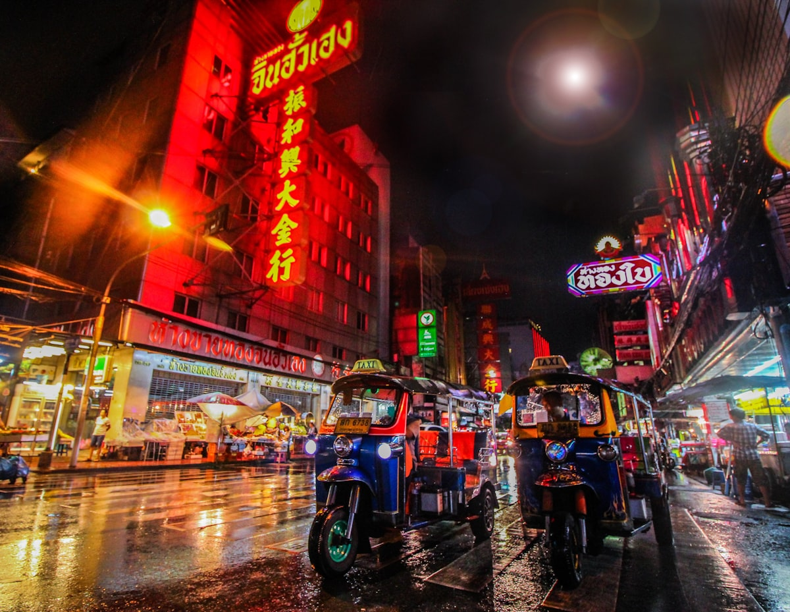

Bangkok is the city that never quite resolves itself into a single idea. Walk ten minutes from a solemn golden temple and you are in a street market of dazzling chaos — noodle vendors, tuk-tuks weaving between buses, flower garlands for sale beside phone repair stalls. The heat wraps around everything. The smells layer: jasmine, charcoal, river, diesel, and always somewhere nearby the sweetness of mango with sticky rice. Bangkok is relentless and magnificent.

### Wat Pho and the Grand Palace

The **Grand Palace** compound contains some of the most breathtaking religious architecture in Asia. The spires of **Wat Phra Kaew** — the Temple of the Emerald Buddha — are encrusted with millions of pieces of glass and ceramics that fracture sunlight into something almost hallucinatory. Just next door, **Wat Pho** houses a 46-metre-long golden reclining Buddha whose feet alone stand at three metres tall. The mother-of-pearl inlay on the soles of those feet depicts 108 auspicious characteristics of the Buddha — stare long enough and you begin to lose count and find peace simultaneously.

### Chao Phraya and the Khlongs

Bangkok was once called the Venice of the East, and its network of canals — the **khlongs** — still carry a pulse of daily life that the streets above cannot replicate. Take the **Chao Phraya Express Boat** upriver and then switch to a longtail boat into the Thonburi canals. Here, floating vendors sell grilled corn, children wave from wooden docks, and the riverside **Wat Arun** — Temple of Dawn — appears around a bend like a fever dream, its tower studded with Chinese porcelain that sparkles in the afternoon sun.

### Gotchas & Tips

- **Temple Dress Code**: Shoulders and knees must be covered at all temples. Carry a light scarf in your bag — you will need it multiple times a day, and vendors sell sarongs outside the Grand Palace at extortionate prices.
- **Tuk-tuk Wisdom**: The free "city tour" offered by tuk-tuk drivers always includes a detour to a gem store or tailor shop where they collect a commission. Either agree to this upfront as entertainment, or negotiate a direct fare from the start.
- **Eating Strategy**: Bangkok's best food is almost always on the street or in a shophouse. A bowl of **pad see ew** from a cart that has been in the same spot for thirty years will outlast any hotel restaurant meal in memory.

### Highlights

- **Wat Arun at Sunset**: The riverside temple glows orange at dusk in a way that justifies every travel photo ever taken of it.
- **Chatuchak Weekend Market**: Over 15,000 stalls selling everything from live exotic fish to vintage denim. Arrive at 9 AM with no agenda.
- **Chinatown on Yaowarat Road**: Bangkok's Chinese quarter explodes into its best self after dark — the best dim sum, roast duck, and mango sticky rice all within walking distance.
- **Jim Thompson House**: The former home of the American silk entrepreneur is an extraordinary preserved compound of Thai antiques and architecture.

Bangkok demands nothing of you except full presence. Give it that, and it gives back tenfold.

<small>_Photo by [silvia](https://unsplash.com/photos/E6y9QkZJZGw) on Unsplash_</small>
