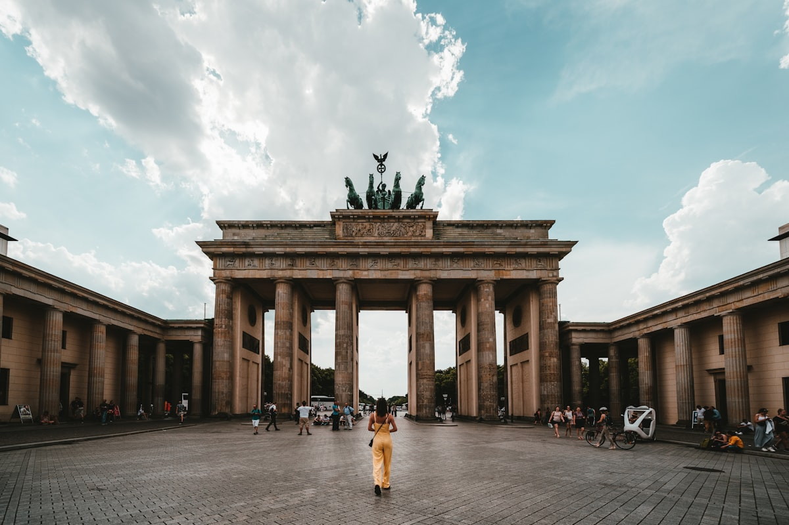

Berlin is a city that refused to stay broken. Walking through neighborhoods like Mitte and Prenzlauer Berg, you can feel decades of division and reunion compressed into a single city block — a communist-era apartment block standing next to a gleaming glass startup office, murals of rebellion facing a luxury boutique hotel. Nowhere else does the weight of the twentieth century feel so immediate, so alive.

### East Side Gallery and the Wall's Legacy

The **East Side Gallery** stretches for 1.3 kilometers along the Spree River — the longest remaining section of the Berlin Wall, now transformed into an open-air gallery of 105 murals by artists from around the world. The most iconic image, Brezhnev and Honecker locked in a kiss, remains as darkly funny as ever. Walk it early in the morning before the crowds arrive and the murals feel genuinely haunting. Just north of here, the **Berlin Wall Memorial** on Bernauer Strasse preserves a section of the original death strip — a sobering contrast to the gallery's defiant art.

### Kreuzberg's Creative Pulse

If the Wall represents Berlin's past, **Kreuzberg** embodies its present. This neighborhood pulses with Turkish bakeries, vinyl record shops, and underground clubs that don't open until 2 AM. The **Markthalle Neun** on Thursday evenings hosts a street food market where you can eat your way from Turkish lahmacun to Vietnamese bánh mì in a single evening. The area around **Schlesisches Tor** is especially vibrant — this is where Berlin's legendary nightlife intersects with its immigrant communities to create something genuinely unlike anywhere else in Europe.

### Gotchas & Tips

- **Club Culture**: Berlin's clubs like Berghain are notoriously selective at the door. Don't dress up — casual, dark clothing works best. Speak as little as possible and project confidence rather than tourist excitement.
- **Museum Island Timing**: The five museums on **Museumsinsel** require a full day. Buy the combined day ticket and arrive at the Pergamon Museum first thing — its ancient reconstruction of Babylon's Ishtar Gate is staggering.
- **The Bike Reality**: Berlin is flat and has excellent cycle paths. Renting a bike is genuinely the best way to travel between neighborhoods, but watch out for tram tracks — they can catch a narrow tire at an angle.

### Highlights

- **East Side Gallery**: Where political history became a canvas for global artists.
- **Checkpoint Charlie**: Campy but historically significant — the museum next door is worth every cent.
- **Neues Museum**: Home to the bust of Nefertiti, one of the most quietly devastating objects in any museum on earth.
- **Tiergarten at Dawn**: Berlin's central park is immense, and walking it before the city wakes up feels like having a secret.

Berlin doesn't just tolerate its scars — it exhibits them, questions them, and ultimately dances on top of them. This is a city that knows how to be free.

<small>_Photo by [Norbert Braun](https://unsplash.com/photos/naGF02nMH5U) on Unsplash_</small>
