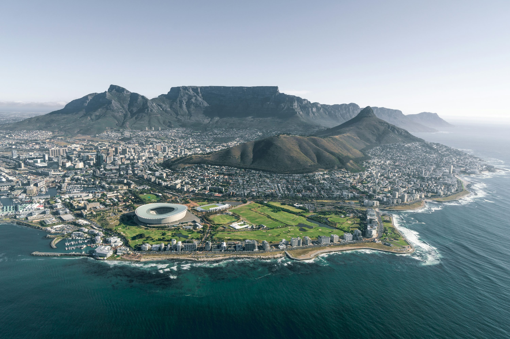

Cape Town is a city where the mountain meets the sea, and nowhere is that more evident than the iconic silhouette of Table Mountain. As someone who loves a bit of a historical mystery, I was fascinated to learn about the legend of Van Hunks and the Devil, whose smoking contest is said to create the "tablecloth" of clouds that often drapes over the peak.

### Reaching the Summit
We decided to mix things up: we took the **Aerial Cableway** up to catch the morning light and hiked down via **Platteklip Gorge**. The cableway is a marvel—the floor rotates 360 degrees, giving you a panoramic view of the city and the Atlantic Seaboard as you ascend. Once on top, the world falls away. We spent two hours just wandering the flat plateau, which is surprisingly rich in *fynbos* (local flora) and tiny rock hyraxes (locally known as dassies) that look like oversized guinea pigs!

### Penguins and Pastries
After our mountain descent, we drove out to **Boulders Beach** in Simon's Town. Nothing prepares you for the sheer cuteness of a colony of African penguins waddling across the white sand. For dinner, we dove into the local Cape Malay cuisine. I had a piping hot bowl of **Bobotie**—a spiced minced meat bake topped with a savory egg custard—paired with some spicy **Biltong** for the road. It’s a flavor profile that is uniquely South African: sweet, savory, and spicy all at once.

### Gotchas & Tips
*   **The Wind Factor**: Table Mountain has a mind of its own. If the "South-Easter" wind blows too hard, the cableway shuts down immediately. Check the live status on their website before you head out.
*   **Book Ahead**: The queue for the cable car can be 2+ hours in peak season. Buy your tickets online to skip the first line.
*   **Safety First**: If you’re hiking, never go alone and always carry a map and plenty of sunblock. The weather can change in minutes.

### Highlights
- **The Cableway**: A 360-degree view of the "Mother City."
- **Platteklip Gorge**: A strenuous but rewarding hike through the mountain's heart.
- **African Penguins**: Seeing them at Boulders Beach is a must for nature lovers.
- **Bobotie**: The ultimate Cape Town comfort food.

Cape Town is a city of extremes—heights, depths, and incredible flavors. It’s a place that invites you to breathe deeper and look further.

<small>*Photo by [Kalen Emsley](https://unsplash.com/photos/Bkci_m9cdvg) on Unsplash*</small>
