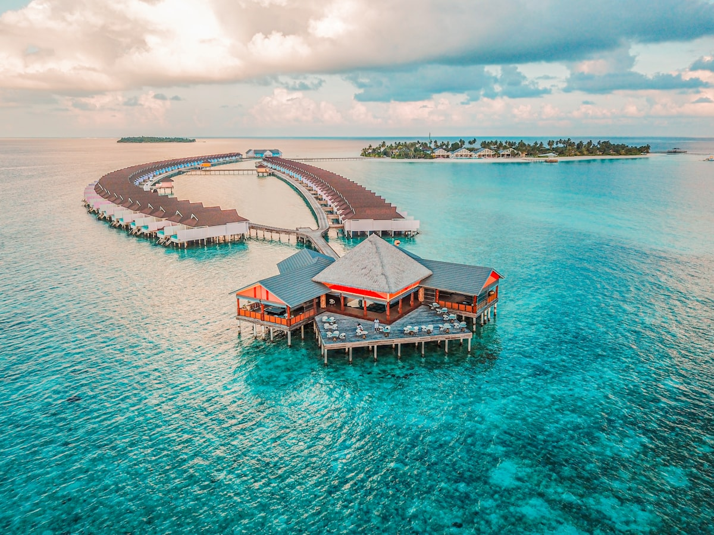

The first time you look down from an overwater bungalow into water so clear that the coral twenty metres below is perfectly visible — and a sea turtle moves through it with absolute unhurried elegance — something recalibrates. The Maldives is one of those places where the natural reality genuinely exceeds what the photographs suggested was possible. The water is the colour that other oceans are trying to be. The reefs are alive in a way that recalibrates your understanding of the word alive. And the stillness here is an active thing — not the absence of noise but the presence of the ocean.

### The Overwater Bungalow Experience

The **overwater bungalow** is the defining architecture of the Maldives — a structure built over the lagoon on wooden stilts, with a glass floor panel above the reef below and a ladder descending directly into the water. Every resort in the Maldives has them in some variation, ranging from simple and affordable to the kind of lavishness that comes with its own plunge pool and butler service. The key variable is the reef directly below: some resorts have live, colourful coral beneath their bungalows; others, degraded or bleached reef. Research the specific reef condition before booking — it makes an enormous difference to the experience of snorkelling from your deck at dawn.

### The Reef and What Lives In It

The Maldives sits atop an underwater mountain range — the atolls are the tips of ancient volcanoes — and the nutrient-rich currents that move between the atolls support extraordinary marine biodiversity. **Whale sharks** — the largest fish on earth — are reliably seen in South Ari Atoll from June to November. **Manta rays** congregate at cleaning stations across the atolls, hovering while small fish remove parasites in a symbiotic ballet. The **house reef** of a good resort will offer, on any given morning snorkel, more reef fish species than most people have seen in a lifetime.

### Gotchas & Tips

- **The Budget Reality**: The Maldives is expensive at the resort level because every resort is its own island — supply chains are complex and there is no local village economy to draw on. The alternative is the **local island network** — staying in guesthouses on inhabited islands like Maafushi or Ukulhas gives a very different, far more affordable, and genuinely authentic experience of Maldivian daily life.
- **Transfer Logistics**: Most resorts are reached by seaplane (spectacular, and the first fifteen minutes of any Maldives trip) or speedboat from Malé. Seaplanes only operate in daylight — if your arrival flight lands after dark, you will overnight in Malé regardless of what the resort website implies.
- **Reef Respect**: The Maldives coral reef ecosystem is under serious climate pressure. Snorkel and dive responsibly: no touching, no standing on coral, no sunscreen (use reef-safe mineral-based SPF only), no feeding of fish.

### Highlights

- **Dawn Snorkel from Your Deck**: Before other guests are awake, the reef below the bungalow belongs entirely to you — the light at this hour through the water is extraordinary.
- **Dhoni Sunset Cruise**: A traditional wooden Maldivian sailing boat (dhoni) at sunset, with the atolls spreading to the horizon — this is the correct way to end any day here.
- **Night Snorkel**: Many resorts offer night snorkelling with torches — bioluminescent plankton, sleeping parrotfish in their mucous sleeping bags, and moray eels moving freely are all visible.
- **Mas Huni Breakfast**: The traditional Maldivian breakfast of smoked tuna, grated coconut, chilli, and onion with flatbread roshi is available on the local islands and at some resorts — extraordinary in simplicity.

The Maldives does not ask you to be anywhere else. For however long you stay, here is entirely sufficient.

<small>_Photo by [Ishan @seefromthesky](https://unsplash.com/photos/fWER_4yEs-I) on Unsplash_</small>
