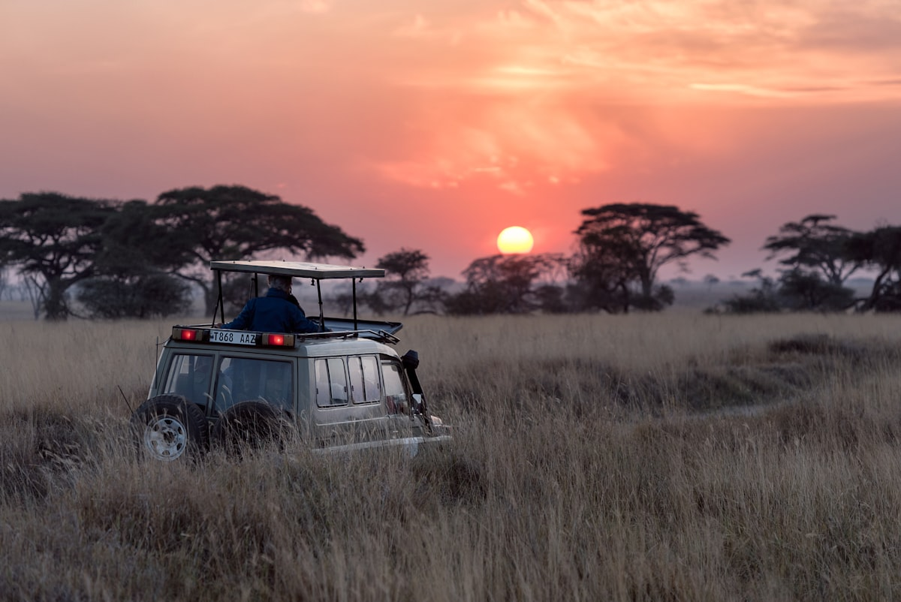

The Mara River crossing happens without warning. One moment there are perhaps a thousand wildebeest standing at the bank, uncertain, pressing against each other in a collective hesitation. Then something shifts — one animal commits — and suddenly the entire herd pours over the edge and into the crocodile-filled current in a thundering, churning mass of hooves and horns and mud. The air fills with dust and the sound of something primordial. This is the Great Migration, the largest movement of land mammals on earth, and witnessing it is one of the most viscerally affecting experiences that nature offers.

### The Migration and the Big Five

The **Masai Mara National Reserve** in southwestern Kenya is the northern terminus of a migration route that loops annually through the Serengeti ecosystem — some 1.5 million wildebeest, alongside hundreds of thousands of zebra and gazelle. The river crossings (typically July to October) are the most dramatic moments, but the Mara is rich with predator-prey drama year-round. The **Big Five** — lion, elephant, buffalo, leopard, and rhino — are all present, and the Mara's open savannah landscapes make sightings easier than in most African parks. A pride of lions sleeping in the morning sun, indifferent to your vehicle two metres away, resets every assumption you have about wildness.

### The Maasai Community

The **Maasai** people — seminomadic cattle herders who have coexisted with the wildlife of this landscape for centuries — are as much a part of the Mara's identity as the wildebeest. Many camps offer **cultural visits to Maasai manyattas** (villages) where community members share aspects of their traditions, from fire-making to beadwork. The income from responsible tourism is increasingly important to communities that once faced pressure to abandon their lands. The red-robed herdsmen visible at dusk against the savannah grass, walking home with their cattle, is one of East Africa's defining images.

### Gotchas & Tips

- **Peak Season Timing**: The migration river crossings occur most reliably from late July through October. Game drives at this time require early rising — 5:30 AM departures are not unusual, and the golden light of the first hour is worth every alarm.
- **Camp Selection**: The difference between a basic tented camp and a premium conservancy camp is significant. Conservancies outside the main reserve boundary offer off-road driving, night drives, and guided walks — none of which are permitted in the main reserve. They are worth the extra cost.
- **Packing for the Bush**: Neutral-coloured clothing (khaki, olive, beige) is not just aesthetic — it matters for not disturbing wildlife. Avoid white and bright colours. Binoculars are essential; a 10x42 is ideal for the open Mara landscape.

### Highlights

- **Mara River Crossing**: The natural event that makes the Mara famous — timing your visit around the crossings requires working with an experienced guide.
- **Dawn Balloon Safari**: Floating silently over the Mara at sunrise, watching herds move below, is the most beautiful way to understand the scale of the landscape.
- **Leopard in a Tree**: The Mara's leopard population is healthy and relatively habituated to vehicles — seeing one draped over a sausage tree branch is a bucket list experience.
- **Sundowner on the Savannah**: A cold drink at the edge of the escarpment as the sun goes down over the Mara Triangle, watching the light turn the grass gold, is difficult to describe to anyone who has not done it.

The Masai Mara asks nothing of you except to be still and pay attention. The landscape does the rest.

<small>_Photo by [Grace Nandy](https://unsplash.com/photos/koLqvTcyI7U) on Unsplash_</small>
