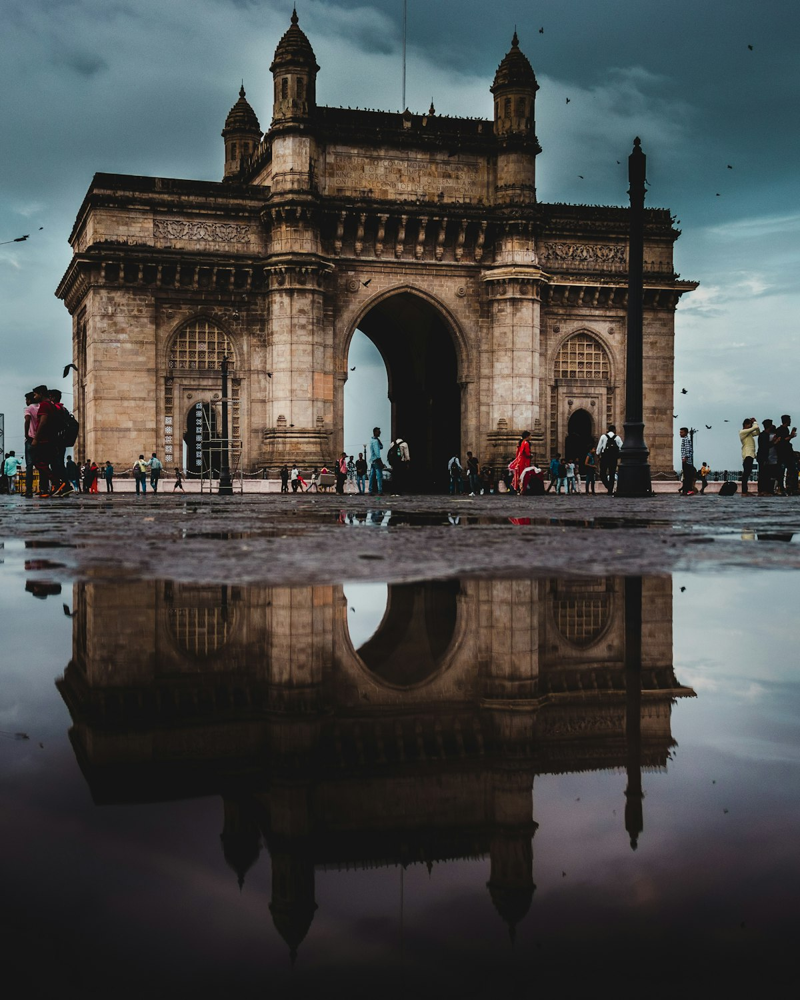

Mumbai arrives as a full sensory event the moment you step outside. The air is warm and salt-tinged from the Arabian Sea, the traffic is operatic, and somewhere nearby — always — there is the smell of something excellent being cooked. This is a city of seventeen million people that has collectively decided to aim higher than seems reasonable, and somehow regularly succeeds. Bollywood, finance, street food, and colonial architecture all compete for the same square kilometre, and the result is one of the most electrically alive cities on earth.

### Gateway of India and Colaba

The **Gateway of India** — a monumental arch built to commemorate the visit of King George V in 1911 — stands at the waterfront of Colaba, directly across from the imperial bulk of the **Taj Mahal Palace Hotel**. The contrast between the colonial grandeur of this waterfront and the fishing boats bobbing in the harbour below is very Mumbai. The neighbourhood of **Colaba Causeway** behind the Gateway is one of the great Indian street markets — silver jewellery, knockoff designer goods, used books, and excellent cutting chai available simultaneously.

### Dharavi and South Mumbai's Architecture

South Mumbai's Victorian and Art Deco architecture makes it one of the most remarkable streetscapes in Asia. The **Chhatrapati Shivaji Maharaj Terminus** — formerly Victoria Terminus — is a UNESCO-listed Gothic railway station of jaw-dropping elaborateness that processes hundreds of thousands of commuters every day. To understand Mumbai's complexity fully, a walking tour of **Dharavi** (one of Asia's largest informal settlements) reveals not a slum but a self-sustaining industrial and residential community of remarkable ingenuity. Reputable local organizations offer responsible tours.

### Gotchas & Tips

- **Local Train Etiquette**: Mumbai's suburban train network is the lifeblood of the city and remarkably easy to use with a tourist smart card. Use the correct carriage — women's carriages are clearly marked and strictly enforced, as are first-class sections.
- **Monsoon Timing**: The monsoon (June to September) transforms Mumbai dramatically — the heat breaks but flooding can be severe. Visit October to February for the best weather.
- **The Vada Pav Question**: Mumbai's street food is extraordinary, but the **vada pav** — a spiced potato fritter in a bread roll with chutney — is the city's true civic dish. Eat it standing at a stall and understand everything.

### Highlights

- **Marine Drive at Dawn**: The curved Art Deco promenade is at its most peaceful before 7 AM, when the fishing boats are still returning and the city is just waking.
- **Elephanta Caves**: A one-hour ferry from the Gateway of India delivers you to eighth-century rock-cut Hindu temples — a complete world apart.
- **Dhobi Ghat**: The world's largest open-air laundry, visible from an overpass on Dr Babasaheb Ambedkar Road — an extraordinary working spectacle.
- **Bandra-Worli Sea Link**: The eight-lane cable-stayed bridge is best appreciated from a boat at sunset, when the cables light up against the darkening sea.

Mumbai never asks you if you are ready. It assumes competence, and in doing so, it brings out the best in you.

<small>_Photo by [Zoshua Colah](https://unsplash.com/photos/5Q-1qKP8HKY) on Unsplash_</small>
