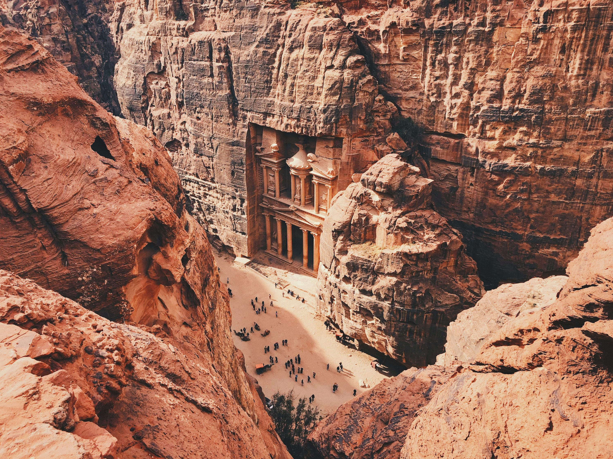

Petra isn’t just a destination; it’s a time machine. As a photographer, I’ve seen thousands of images of the Treasury, but nothing prepares you for that first glimpse through the Siq. The way the morning light hits the rose-colored sandstone is a dream for anyone with a lens—or just a soul.

### The Journey into the Past

Our day started at 6:00 AM. If you take one piece of advice from me: **get there early**. We entered the Siq—a narrow, winding gorge that stretches for over a kilometer—just as the sun began to peek over the cliffs. Walking between those 80-meter high walls, you can almost hear the echoes of Nabataean caravans from 2,000 years ago.

Then, it happens. The walls part, and there it is: **Al-Khazneh (The Treasury)**. It’s taller and more intricate than any photo suggests. I spent a good hour just playing with the shadows on the Corinthian columns while sipping some of the best **Bedouin peppermint tea** I’ve ever had.

### Climbing to the Monastery

While most tourists stop at the Treasury, we pushed on. The 800-step climb to **Ad Deir (The Monastery)** is no joke, especially with a camera bag, but the view is reward enough. It’s massive—larger than the Treasury—and far more peaceful.

### A Taste of Jordan

You can't visit Jordan and not talk about the food. After our hike, we sat down for a traditional **Mansaf**—tender lamb cooked in a sauce of fermented dried yogurt and served over a mountain of rice. It’s rich, savory, and the ultimate comfort food after a day of trekking. Pro tip: eat with your right hand as the locals do; it makes the experience feel that much more authentic!

### Gotchas & Tips

- **The Shoe Situation**: Wear the most comfortable hiking boots you own. You will easily walk 15-20km in a day.
- **Donkey Rides**: You’ll be offered many rides. If you’re able-bodied, I recommend walking. The path is part of the story, and some of the animal welfare standards can be hit-or-miss.
- **Stay Hydrated**: The desert heat is relentless. Carry more water than you think you need.

Petra is a place that demands respect and rewards curiosity. If you haven't booked your flight to Amman yet, what are you waiting for?

### Highlights

- **The Siq**: A dramatic 1.2km walk into the heart of the city.
- **The Treasury**: Best viewed between 9 AM and 11 AM for the best light.
- **Mansaf**: The national dish you absolutely must try.
- **Bedouin Hospitality**: Never turn down a cup of tea!

Stay tuned for more updates from our journey across Jordan!

<small>_Photo by [Alex Vasey](https://unsplash.com/photos/5_Bu25SV6X8) on Unsplash_</small>
