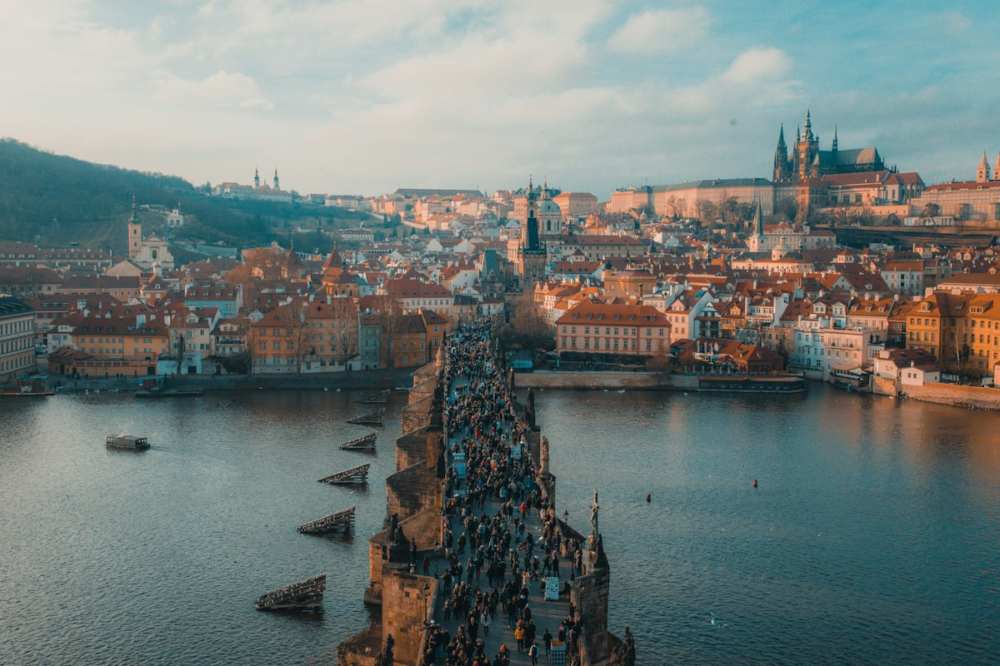

There is a moment on **Charles Bridge** at dawn — before the crowds, before the tour groups, when the morning mist is still threading between the baroque statues and the Vltava River below is perfectly still — when Prague looks less like a city and more like a set designed by someone who wanted to demonstrate what Central European history looked like at its most concentrated and beautiful. It is a city of spires and cobblestones and beer cellars and Kafka, and somehow it holds all of these things without contradiction.

### Prague Castle and the Old Town

**Prague Castle** is the largest ancient castle complex in the world — a hilltop city unto itself, containing a cathedral, royal palace, galleries, gardens, and a golden lane of former alchemists' workshops. **St. Vitus Cathedral** within the castle complex is Gothic of the highest order, its stained glass by Alfons Mucha among the finest in Europe. From the castle walls, the panorama over the city's red-roofed old town and the river bridges is the quintessential Prague image. Below, the **Old Town Square** with its astronomical clock (Orloj) and the twin spires of Týn Church is the medieval civic heart — full of crowds but genuinely magnificent even so.

### Josefov and the Jewish Quarter

The **Jewish Quarter** of **Josefov** contains six historic synagogues and Europe's second-oldest Jewish cemetery — thousands of gravestones stacked in layers, the inscriptions worn by centuries of weather, in a space too small for the number of people buried there. The **Old-New Synagogue**, dating from 1270, is one of the oldest active synagogues in Europe and contains in its attic, according to legend, the Golem created by Rabbi Loew — a constructed being of clay who protected the Jewish community. This layer of history, legend, and genuine tragedy makes Josefov one of the most affecting districts in any European city.

### Gotchas & Tips

- **Charles Bridge Timing**: Visit Charles Bridge at dawn or after 9 PM to experience it without crowds. At any other time, the bridge is a slowly moving mass of tourists. The statues — thirty baroque figures added between 1683 and 1714 — are extraordinary; touch the plaque of St. John of Nepomuk (gleaming from millions of hands) for luck.
- **The Beer Reality**: Czech beer — specifically **Pilsner Urquell** and the various Bohemian lager styles — is genuinely extraordinary and remarkably inexpensive. The **Lokál** restaurant chain serves tank-unpasteurised Pilsner Urquell at the correct temperature and pressure and does a complete Czech menu alongside.
- **Beyond the Old Town**: Prague rewards walking away from the tourist centre. The neighbourhoods of **Vinohrady** (Art Nouveau apartment blocks, independent wine bars) and **Žižkov** (bohemian, beer-dense, the enormous television tower with baby sculptures) are where contemporary Prague lives.

### Highlights

- **St. Vitus Cathedral Stained Glass**: Alfons Mucha's nave window glows with colour in a way that makes the rest of the cathedral feel like a setting for it.
- **Petřín Hill**: A forested hill with a miniature Eiffel Tower observation platform, accessible by funicular from Malá Strana — the view from the top contextualises the entire castle complex.
- **Café Savoy**: The restored grand café in Malá Strana is the finest place in Prague for breakfast — vaulted neo-Renaissance ceiling, extraordinary pastries, impeccable coffee.
- **Kutná Hora**: An hour from Prague by train, the **Sedlec Ossuary** — a church decorated with the bones of 40,000 people — is macabre, artistic, and impossible to forget.

Prague is the city that made a careful decision to survive with its beauty intact. Standing in its ancient streets, you understand that this was exactly the right decision.

<small>_Photo by [Jaromír Kavan](https://unsplash.com/photos/ubQDHALqKiM) on Unsplash_</small>
