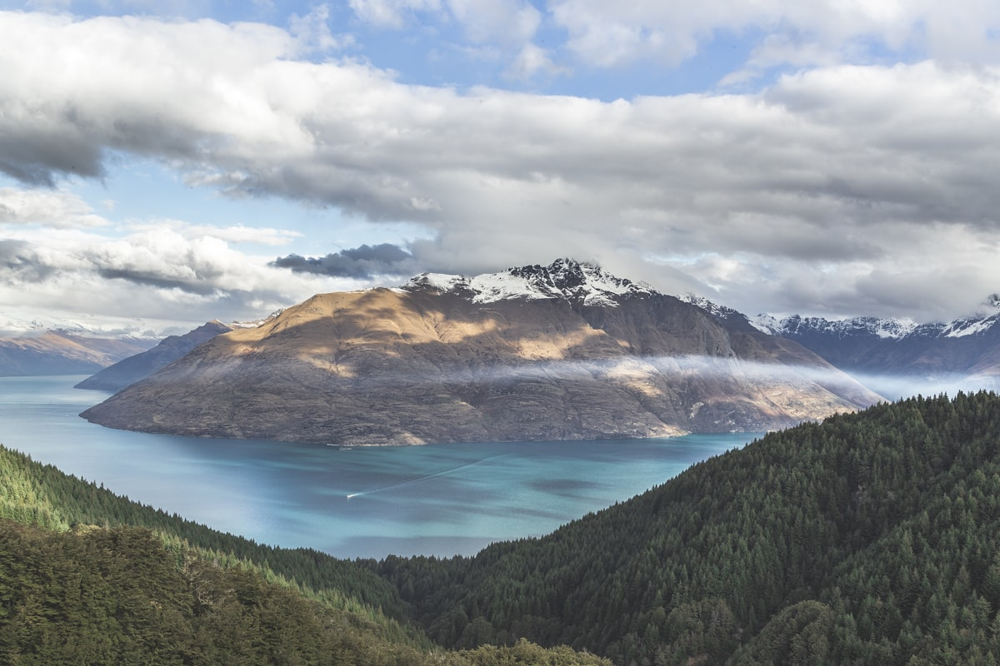

Queenstown sits in a bowl of mountains that seem designed specifically to accelerate adrenaline. The Remarkables range rises directly from Lake Wakatipu's southern shore in a wall of jagged schist peaks; Coronet Peak commands the northern skyline; and the lake itself — 84 kilometres long, shaped in a Z that local legend explains as the outline of a sleeping giant — reflects everything back with the clarity of perfect mirror water. This is the kind of landscape that makes you want to do something extreme just to feel adequate to it.

### The Remarkables and Skyline Gondola

In winter, the **Remarkables Ski Area** offers one of the most scenic ski fields in the southern hemisphere — the lake visible from almost every run, snow reliable from June through September. In summer, the same terrain becomes mountain biking and hiking territory of remarkable quality. The **Skyline Gondola** rises 450 metres from the town centre to a ridge where the panoramic view over the lake and surrounding ranges requires a long pause to fully absorb. From the top, the **Ben Lomond Track** continues another 1,748 metres higher for a full-day summit hike that rewards with views across two distinct mountain ranges.

### Glenorchy and the Road to Paradise

The road from Queenstown to **Glenorchy** — forty-five minutes along the northern shore of Lake Wakatipu — is one of the finest drives in New Zealand, and that is saying something. The mountains press closer, the lake narrows, and the farmland becomes increasingly cinematic (much of the Lord of the Rings landscape was filmed in this area). Beyond Glenorchy, the road continues to **Paradise** — an aptly named river flat beneath the Dart Glacier — and the start of the **Rees-Dart Track**, one of New Zealand's great multi-day wilderness walks.

### Gotchas & Tips

- **Adrenaline Fatigue is Real**: Queenstown's activity operators compete fiercely and the result is excellent safety standards. But with bungee, skydiving, jet boating, white water rafting, and canyon swinging all on offer, choose one or two genuinely meaningful experiences rather than ticking every box.
- **Wine Region Proximity**: The **Central Otago** wine region begins just forty minutes east of Queenstown. Its pinot noir is among the finest in the world — the wineries around **Gibbston Valley** and **Bannockburn** offer cellar-door tastings in extraordinary dry schist gorge scenery.
- **Seasonal Timing**: Queenstown works year-round but for different reasons. Winter (June to August) is for skiing; summer (December to February) is for hiking and lake activities; autumn (March to May) brings the most spectacular colour — aspens and poplars turning gold against the mountain backdrop.

### Highlights

- **Bungee at the Kawarau Bridge**: The original commercial bungee jump site from 1988, still spectacular at 43 metres above the river.
- **Fergburger**: The legendary Queenstown burger institution — queue at midnight with the après-ski crowd for a burger that justifies every superlative.
- **Lake Wakatipu Steamer**: The vintage TSS Earnslaw has been steaming across the lake since 1912, and a round trip to Walter Peak Station remains one of the finest ways to see the mountains from the water.
- **Arrowtown**: The historic gold-mining village twenty minutes from Queenstown has the best autumn colour in New Zealand and an excellent museum of the Chinese gold-miners' experience.

Queenstown does not moderate itself. It offers the full volume of the natural world, and the only reasonable response is to say yes.

<small>_Photo by [Jeff Finley](https://unsplash.com/photos/9da-AbKbr-g) on Unsplash_</small>
