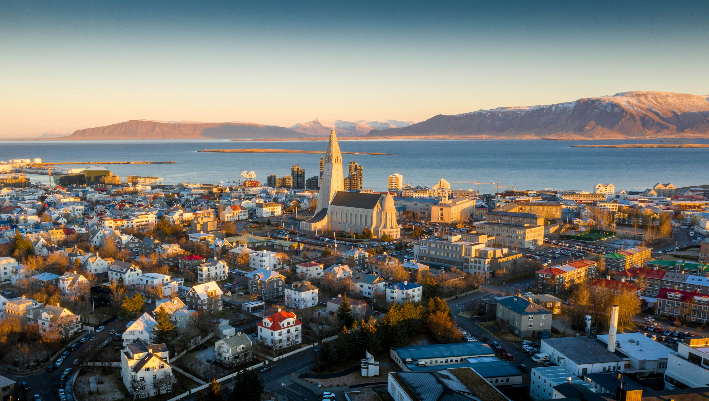

Reykjavik is a city that feels like it’s built on the edge of the world. As someone who loves the intersection of nature and wellness, Iceland is the ultimate destination. There is something primal and healing about a land that is literally being built by fire and carved by ice.

### Fire and Ice Therapy

We started our trip with a long soak in the **Blue Lagoon**. Yes, it’s touristy, but floating in that milky blue, silica-rich geothermal water as the cold Icelandic wind whips your face is a unique kind of bliss. It felt like a deep-tissue massage for my whole spirit.

We also did the **Golden Circle tour**, seeing the massive Gullfoss waterfall and the erupting Strokkur geyser. But the highlight was our night spent **hunting the Aurora**. We drove far outside the city light pollution, and just after midnight, the sky exploded in green and purple ribbons. Seeing the Northern Lights dance across the sky is a moment of pure wonder that makes you feel very small and very lucky.

### Icelandic Comforts

Icelandic food is all about hearty, simple ingredients that help you withstand the cold. I couldn't get enough of the **traditional lamb soup**—slow-cooked with root vegetables and served with dark, dense rye bread. For a quick snack, I fell in love with **Skyr**, a thick, creamy dairy product that’s technically a cheese but eaten like yogurt. It’s high in protein and perfect for a day of exploring.

### Gotchas & Tips

- **Layers are Mandatory**: The Icelandic weather changes every five minutes. Dress in "onions"—layers you can peel off and put back on as the sun, rain, and snow alternate.
- **4x4 is a Must**: If you plan to drive the Ring Road or head into the highlands, rent a 4x4. The winds can be incredibly strong, and the roads can be treacherous.
- **Alcohol is Expensive**: If you want to enjoy a beer or wine at your hotel, buy it at the duty-free shop when you land. Prices in the city are 3-4x higher.

### Highlights

- **The Northern Lights**: A cinematic masterpiece by nature.
- **Blue Lagoon**: Geothermal healing at its finest.
- **Gullfoss Waterfall**: The sheer power of the water is humbling.
- **Lamb Soup**: The ultimate Icelandic comfort in a bowl.

Reykjavik is a city of raw beauty and warm hearts. It’s a place that asks you to embrace the elements and find the magic in the cold.

<small>_Photo by [Nicolas J Leclercq](https://unsplash.com/photos/0_S_b_x_J_I) on Unsplash_</small>
