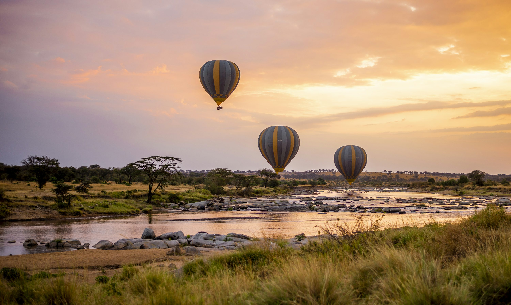

The Serengeti is a place where nature exists in its purest, most unedited form. As someone who focuses on wellness and nature, I found a profound sense of grounding in the vast, open plains of Tanzania. There is a deep, rhythmic peace to the savanna that resets your entire nervous system.

### Floating over the Savage Paradise
We did something I’ll never forget: a **sunrise hot air balloon safari**. Drifting silently over the savanna as the first golden rays hit the grass is an experience of pure awe. From above, we saw a massive herd of wildebeest on their Great Migration, looking like a single, giant organism moving across the earth.

Back on solid ground, our **game drives** were equally spectacular. We spent an afternoon near a watering hole, watching a pride of lions resting in the shade of an acacia tree. We also visited a local **Maasai village**, where we learned about their ancient relationship with this land and were invited to join in their traditional jumping dance. Their connection to the rhythm of the earth is something we’ve largely lost in the West.

### Savanna Sustenance
The food was a highlight I didn't expect. I fell in love with **Ugali**, a dense, dough-like side made from maize flour that is perfect for scooping up stews. For a real treat, we had **Nyama Choma** (roasted meat), which was smoky, tender, and served with a zesty tomato and onion salad called *kachumbari*. It’s simple, hearty food that fuels you for long days in the sun.

### Gotchas & Tips
*   **Binoculars are Non-Optional**: You’ll see plenty with the naked eye, but the real magic happens in the details. Invest in a good pair.
*   **Respect the Space**: Never encourage your driver to get closer to the animals for a "better photo." We are visitors in their home.
*   **Dust is Everywhere**: Bring a scarf or "buff" to cover your face during game drives, and wrap your camera in a plastic bag when not in use.

### Highlights
- **Balloon Safari**: The most peaceful way to see the world's most dramatic landscape.
- **Lion Sightings**: A powerful reminder of nature's hierarchy.
- **Ugali and Stew**: The ultimate Tanzanian soul food.
- **The Night Sky**: With no light pollution, the Milky Way looks like you could touch it.

The Serengeti is a place that humbles you. It’s a reminder that we are just one small part of a much larger, much older story.

<small>*Photo by [Sutirta Budiman](https://unsplash.com/photos/G_m_R_S_J_Y) on Unsplash*</small>
