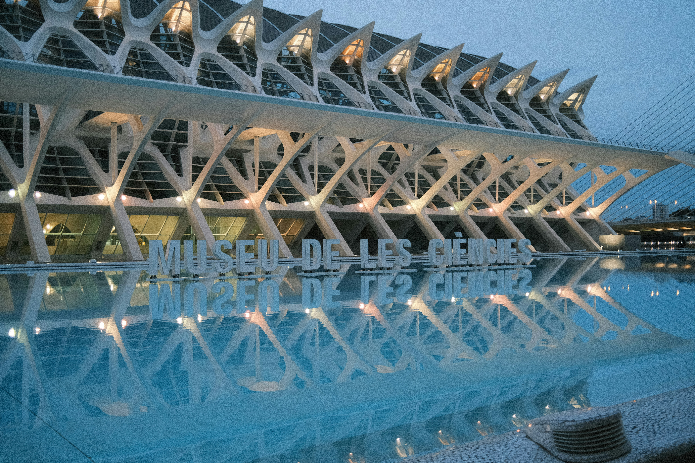

Valencia sits on Spain's Mediterranean coast in a state of relaxed self-confidence. It is not Madrid's political intensity nor Barcelona's restless exhibitionism — it is a city that has been getting on with things for two thousand years and has the layers to prove it. A Roman forum under a shopping street. A Gothic silk exchange that could pass for a cathedral. A cathedral that may or may not contain the Holy Grail. And then, along the old riverbed that was diverted in 1957 after a catastrophic flood, one of the most audacious urban design projects of the twentieth century: the City of Arts and Sciences, a complex of titanium and concrete so alien-looking that it stops first-time visitors in their tracks.

### The City of Arts and Sciences

The **Ciutat de les Arts i les Ciències** is the project that put modern Valencia on the global architectural map. Designed primarily by Santiago Calatrava (with Félix Candela contributing the L'Umbracle and L'Hemisfèric), the complex stretches for nearly two kilometres along the former Turia riverbed. The **L'Hemisfèric**, shaped like a giant eye, houses an IMAX cinema and planetarium. The **Museu de les Ciències Príncep Felip** looks like the skeleton of a prehistoric whale. The **L'Oceanogràfic** — Europe's largest aquarium — was designed by Félix Candela as a series of hyperbolic paraboloid shells resembling waterlily leaves. Come at dusk when the buildings reflect in the long pools and the light turns everything gold.

### The Old City and La Catedral

The old city centres on the **Plaza de la Virgen**, a baroque square that has served as Valencia's civic heart since Roman times. The **Catedral de Valencia** is a study in accumulated centuries — Romanesque, Gothic, Renaissance, and Baroque elements layered over the original mosque. Inside, a small agate chalice in the Chapel of the Holy Grail is claimed by some scholars to be the actual cup used at the Last Supper. Whether or not you accept that claim, the **Torre del Micalet** bell tower offers the finest panorama over the old city's terracotta roofscape.

Two blocks away, the **Llotja de la Seda** — the Silk Exchange — is one of Spain's finest Gothic buildings and a UNESCO World Heritage Site. Its Sala de Contratació, with twenty-four twisted stone columns rising to a vaulted ceiling, was built in the fifteenth century when Valencia was the wealthiest city in the Iberian Peninsula.

### Paella and the Valencian Table

Valencia is where paella was born, and Valencians are unapologetically particular about it. Authentic **paella valenciana** contains chicken, rabbit, flat green beans, butter beans, saffron, and short-grain rice cooked in a wide, shallow pan over orange wood — and emphatically does not contain seafood (that would be _paella de marisco_, a different dish). The best place to eat it is along the **Malvarrosa beach** promenade on a Sunday, where dozens of restaurants serve it to a clientele of local families for whom this is weekly ritual.

The **Mercado Central** — Valencia's central market, housed in a magnificent Art Nouveau building with a ceramic-tiled dome — is one of the great food markets of Europe. Over a thousand stalls sell the produce of the Valencian _huerta_: the intensely irrigated market garden that surrounds the city and has been feeding it since Moorish times.

### Gotchas & Tips

- **The Turia Gardens**: The old Turia riverbed is now a nine-kilometre park running through the heart of the city. Rent a bike and ride the entire length — from the City of Arts and Sciences to the Bioparc — for the best possible introduction to Valencia's geography.
- **Timing Paella**: Paella is strictly a lunchtime dish in Valencia. Ordering it for dinner in a serious restaurant will earn you a polite but firm refusal (or a reheated version). Sunday lunch is the canonical moment.
- **Las Fallas**: If you visit in mid-March, the city ignites for the **Fallas festival** — enormous satirical sculptures are paraded through neighbourhoods and then ceremonially burned on the final night. Book accommodation months in advance.
- **Metro vs. Walking**: The old city is compact and best on foot. The metro connects the centre to the beach, the airport, and the City of Arts and Sciences efficiently.

### Highlights

- **City of Arts and Sciences at Dusk**: The golden-hour reflections in the pools are among the most photogenic scenes in contemporary European architecture.
- **Llotja de la Seda**: Quiet, spectacular Gothic grandeur with almost none of the crowds that descend on comparable monuments in Seville or Toledo.
- **Mercado Central**: Arrive at 10 AM on a weekday for the market at its most alive and the best chance of a conversation with the vendors.
- **Malvarrosa Beach**: A proper urban beach, fifteen minutes from the old city by metro, with good waves and a long promenade lined with paella restaurants.

Valencia rewards slow travel. The more time you give it, the more it gives back.

<small>_Photo by [Matthew Ye](https://unsplash.com/photos/the-city-of-arts-and-sciences-in-valencia-5-O5f9NxD2s) on Unsplash_</small>
