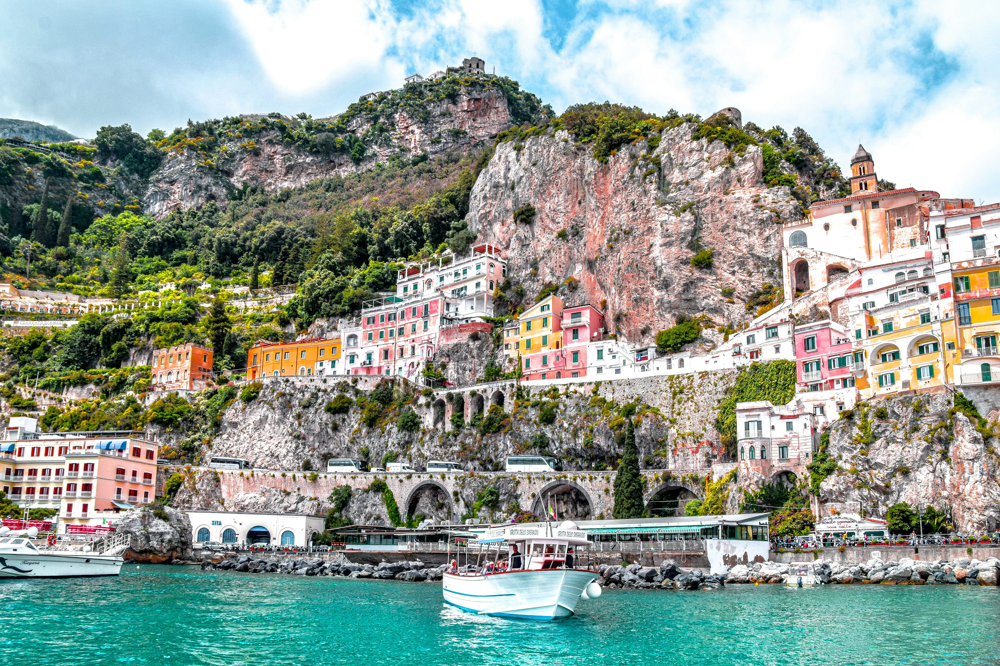

La Costa Amalfitana es un paisaje vertical donde las casas de colores se aferran a los acantilados como percebes de colores brillantes. Como soy un poco fanática de la historia, me interesaban menos los clubes de playa de lujo y más el hecho de que esta escarpada costa fue una vez una de las repúblicas marítimas más poderosas del Mediterráneo.

### Conduciendo el Sueño (y la Pesadilla)

No hay nada como conducir por la SS163, la "Carretera de las Mil Curvas". Con el aroma de los limones entrando por la ventana y el aire salado del Mediterráneo, es pura felicidad, ¡si no te importa la adrenalina de que un autobús turístico se te acerque en una curva de horquilla!

Para cambiar de ritmo, caminamos por el **Sendero de los Dioses (Sentiero degli Dei)**. Este sendero en lo alto del mar ofrece vistas que realmente me hicieron detenerme y recuperar el aliento. Terminamos nuestro día con un **tour privado en barco por Positano**, mirando hacia atrás a la pirámide de casas en colores pastel mientras el sol se hundía bajo el horizonte. Ver Positano desde el agua es la única forma de comprender verdaderamente su escala.

### Una Sinfonía de Mariscos

La cena en Amalfi suele empezar y terminar con limones. Nos sentamos en una pequeña trattoria apartada de la plaza principal y comimos **Scialatielli ai frutti di mare**, pasta gruesa enrollada a mano servida con abundante cantidad de almejas, mejillones y camarones. Y, por supuesto, ninguna comida está completa sin una copa fría de **Limoncello** local. ¡Es sol líquido!

### Consejos y Trucos

- **Deja el coche**: A menos que tengas nervios de acero, toma el autobús SITA o el ferry. El aparcamiento es casi inexistente e increíblemente caro.
- **El "Impuesto de los Pasos"**: Prepárate para los escalones. Miles de ellos. Si tienes problemas de movilidad, quédate en Amalfi o Maiori en lugar de Positano.
- **Las Reservas son la Clave**: Si quieres una mesa con vista para el atardecer, reserva con al menos 2-3 días de antelación durante los meses de verano.

La Costa Amalfitana es un lugar de belleza dramática e historia profunda. Es un poco concurrido, sí, pero algunas cosas son famosas por una razón.

### Puntos Destacados

- **Sendero de los Dioses**: La mejor vista gratuita de Italia.
- **Positano desde el agua**: Pura magia cinematográfica.
- **Scialatielli**: La textura de la pasta es inolvidable.
- **Catedral de Amalfi**: Una impresionante mezcla de arquitectura árabe-normanda.

¡Estén atentos para más actualizaciones de nuestro verano italiano!

<small>_Foto de [Tom Podmore](https://unsplash.com/photos/1zkHXas1GIo) en Unsplash_</small>
