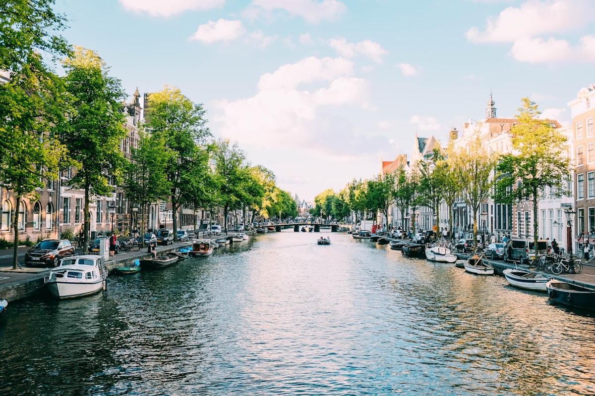

Ámsterdam es una ciudad construida sobre cimientos improbables — millones de pilotes de madera clavados en el suelo pantanoso, una red de 165 canales cavados a mano, y una determinación colectiva de recuperar tierras que el mar claramente quería de vuelta. El resultado es una de las ciudades más bellas y habitables jamás construidas: una cuadrícula de casas de mercaderes del siglo XVII inclinadas en ángulos cómplices hacia sus reflejos en el agua, conectadas por puentes demasiado numerosos para contarlos y navegadas en bicicleta con la confianza de quienes nacieron sobre un sillín.

### El Anillo de Canales y la Edad de Oro

El **Grachtengordel** — el anillo de canales catalogado por la UNESCO — fue construido en un único impulso de ambición durante la Edad de Oro neerlandesa del siglo XVII, cuando Ámsterdam era la ciudad más rica del mundo. Caminando por los canales **Keizersgracht**, **Herengracht** y **Prinsengracht**, estás recorriendo la arquitectura física de ese momento de máxima prosperidad. Las casas del canal son estrechas (gravadas según el ancho), altas y coronadas con distintivas vigas de poleas que aún se usan ocasionalmente. La **Casa de Ana Frank** en el Prinsengracht es uno de los lugares históricos más importantes de Europa — el escondite de una familia judía durante la ocupación nazi, conservado con extraordinario cuidado.

### Museos y el Barrio de Jordaan

El **Rijksmuseum** alberga una de las grandes colecciones del mundo — La Ronda de Noche de Rembrandt y La lechera de Vermeer en el mismo edificio — y merece al menos medio día. El **Museo Van Gogh** de al lado contiene la mayor colección del mundo de obras de Van Gogh: 200 pinturas, 500 dibujos y 750 cartas. Para el arte contemporáneo, el **Stedelijk Museum** es sobresaliente. Pero las mejores horas de Ámsterdam se pasan quizás no en museos sino en el barrio de **Jordaan** — el antiguo barrio obrero inmediatamente al oeste del anillo de canales, hoy un barrio de galerías independientes, tiendas de antigüedades, excelentes cafeterías y los mejores **Bitterballen** (aperitivos fritos holandeses) de la ciudad en los cafés marrones (bruine kroegen) del barrio.

### Consejos y Trucos

- **Supervivencia en Bicicleta**: La infraestructura ciclista de Ámsterdam es extraordinaria, pero las normas son estrictas. Los carriles bici (asfalto rojo o carriles marcados) no son caminos peatonales — caminar en ellos generará genuina frustración local. Alquila una bici en una tienda adecuada, no en un puesto turístico, para una máquina más segura.
- **Colas de Museos**: El Rijksmuseum y el Museo Van Gogh requieren reserva anticipada en línea para evitar colas de varias horas. Esto es innegociable en abril (temporada de tulipanes) y en verano.
- **La Ventana de los Tulipanes**: La famosa temporada de tulipanes de los Países Bajos va de mediados de marzo a mediados de mayo. Los **Jardines de Keukenhof**, a treinta minutos de Ámsterdam, son el mejor jardín de flores del mundo en este época — reserva entradas con meses de antelación.

### Puntos Destacados

- **Museo de Fotografía Foam**: Uno de los mejores museos de fotografía de Europa, en una casa de canal reconvertida — programación consistentemente excelente.
- **Vondelpark en Domingo**: El parque central de la ciudad se convierte en un festival de picnics, músicos callejeros y patinadores en un domingo soleado por la tarde.
- **Arenque Fermentado (Nieuwe Haring)**: La temporada neerlandesa de arenque crudo comienza en junio. Comerlo de la manera tradicional — inclinado hacia atrás, sostenido por la cola — en un puesto del Vismarkt es el auténtico rito de iniciación de Ámsterdam.
- **Barco por el Canal al Atardecer**: Un alquiler de barco privado o un crucero por el canal a la hora dorada, cuando las ventanas de los frontones capturan la luz y sus reflejos ondean en el agua de abajo, es Ámsterdam en su versión más perfectamente propia.

Ámsterdam es una ciudad que recompensa la lentitud. Cuanto más despacio te muevas por ella, más la entenderás.

<small>_Foto de [Eirik Skarstein](https://unsplash.com/photos/Vgr-_65__lw) en Unsplash_</small>
