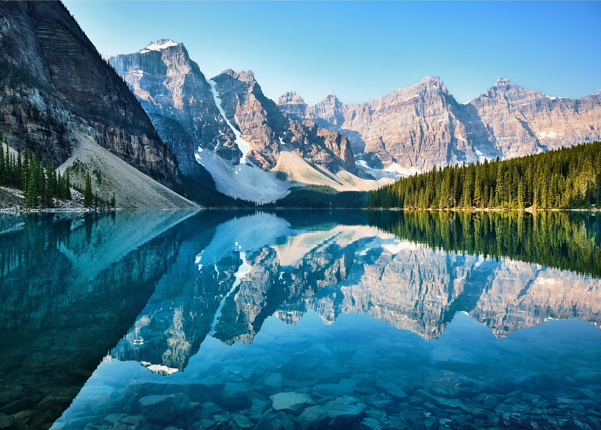

Banff es un lugar donde las montañas no solo se asoman, sino que te abrazan. Como alguien que encuentra la curación en la naturaleza, las Montañas Rocosas canadienses se sintieron como una enorme catedral al aire libre. El aire es tan fresco que sientes que te está limpiando de adentro hacia afuera.

### Lagos de un Azul Imposible
Comenzamos nuestro viaje **haciendo canotaje en el Lago Louise**. El agua es de un turquesa tan brillante que parece haber sido tocada por un resaltador, un efecto causado por la "harina de roca" de los glaciares que se derriten. Es increíblemente sereno remar hasta el centro del lago y sentir el silencio de los picos circundantes.

Después, hicimos la caminata de "ejercicio con recompensa" hasta la **Casa de Té del Lago Agnes**. Es una subida constante, pero sentarse junto a un lago alpino con una taza de té caliente y un scone fresco mientras las cabras montesas deambulan cerca es pura magia. Terminamos nuestro viaje sumergiendo nuestros músculos doloridos en las **Termas de Banff Upper**, viendo cómo el vapor se elevaba en el aire fresco de la montaña mientras salían las estrellas.

### Comodidades Canadienses
Cuando estás en Canadá, tienes que disfrutar de la comida reconfortante. Encontramos un pequeño lugar en la ciudad para un tazón enorme de **Poutine**: papas fritas crujientes, trozos de queso chirriantes y una rica salsa de carne. Es el combustible definitivo para los excursionistas. Por supuesto, ningún viaje a Banff está completo sin un **BeaverTail**, una masa de pan frito con forma de cola de castor, cubierta con canela y azúcar. Es dulce, desordenado y absolutamente delicioso.

### Consejos y Trucos
*   **A quien madruga, Dios le ayuda (con el lago)**: Si quieres ver el Lago Moraine o el Lago Louise sin 5.000 amigos, debes estar allí antes de las 6:00 AM (o mejor aún, toma el autobús de enlace). Los estacionamientos se llenan incluso antes de que salga el sol por completo.
*   **Conciencia sobre los osos**: Este es territorio de grizzlies. Lleva siempre spray para osos (y sabe cómo usarlo) y haz ruido mientras caminas.
*   **Vístete en capas**: Incluso en verano, las temperaturas pueden bajar a casi el punto de congelación por la noche.

### Puntos Destacados
- **Canotaje en el Lago Louise**: Una experiencia obligatoria por una razón.
- **Casa de Té del Lago Agnes**: La mejor vista que tendrás jamás con una taza de té.
- **Termas de Banff**: La forma perfecta de terminar un día de aventuras.
- **La Vida Silvestre**: Ver alces deambulando por el centro de la ciudad es algo cotidiano aquí.

Banff es un lugar que te recuerda la escala del mundo. Es un paisaje que te invita a estar tranquilo y simplemente asombrarte.

<small>*Foto de [Jack Anstey](https://unsplash.com/photos/0_S_b_x_J_I) on Unsplash*</small>
