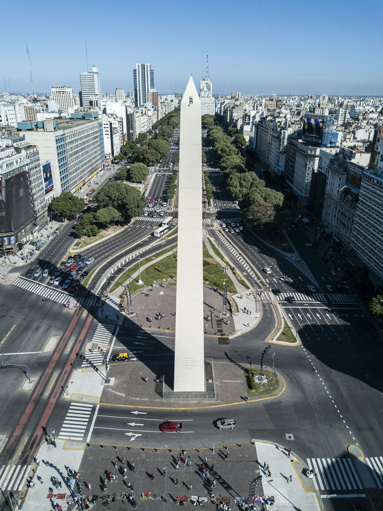

Buenos Aires fue construida para ser magnífica. Las amplias avenidas, la extravagante arquitectura francesa e italiana, los parques y plazas — esta es una ciudad que en su apogeo de principios del siglo XX era genuinamente una de las más ricas del mundo. Esa prosperidad se desvaneció, pero la belleza y el apetito por la vida no. Lo que queda es una de las ciudades más seductoras de América del Sur: cosmopolita, culta, apasionada, y permanentemente en el abrazo de su propia música trágica.

### San Telmo y las Raíces del Tango

**San Telmo** es el barrio más antiguo de Buenos Aires — calles adoquinadas, casonas del siglo XIX, mercados de antigüedades y el hogar original del tango. La música emergió aquí entre las clases trabajadoras inmigrantes a finales del siglo XIX, una fusión de ritmos africanos, polca europea y habanera cubana que de algún modo produjo algo completamente nuevo. El **Mercado de San Telmo** los domingos convoca a bailarines de tango callejeros en su plaza exterior — ver a una pareja bailar en el pavimento, sin escenario ni red de seguridad, al son de un bandoneón y un violín, es una experiencia íntima y genuinamente emotiva. Para una milonga sentada, el **El Viejo Almacén** y **La Catedral** ofrecen experiencias muy diferentes pero igualmente auténticas.

### La Boca y Puerto Madero

El barrio de **La Boca** es famoso por sus casas de chapa ondulada pintadas de vivos colores a lo largo del **Caminito** — una calle peatonal que hoy es más museo al aire libre que barrio vivo, pero sigue siendo visualmente exuberante. Justo más allá, el estadio de fútbol de los **Boca Juniors** (La Bombonera) es un lugar de peregrinación para aficionados al fútbol de todo el mundo. En contraste, el renovado paseo marítimo de **Puerto Madero** — antiguos muelles industriales convertidos en un reluciente barrio de restaurantes, hoteles y un puente peatonal diseñado por Santiago Calatrava — muestra la cara modernizadora de Buenos Aires con considerable estilo.

### Consejos y Trucos

- **Horarios de Comida**: Buenos Aires funciona con horarios muy tardíos. Los restaurantes no se llenan antes de las 9 de la noche como muy pronto; las 11 es lo normal. Una cena de carne a las 10 de la noche en una **parrilla** tradicional es la experiencia bonaerense correcta. Lleva paciencia y buen apetito.
- **La Complejidad Monetaria**: Argentina ha tenido históricamente un tipo de cambio paralelo. Investiga la situación actual antes de llegar — los tipos oficial y no oficial pueden diferir sustancialmente, afectando significativamente tu poder adquisitivo.
- **Lógica de Barrios**: Buenos Aires recompensa la exploración barrial. **Palermo**, con sus boutiques de diseño y restaurantes; **Recoleta**, con su gran cementerio y cultura de café; y **Villa Crespo**, la alternativa local a Palermo — cada uno tiene su propio carácter distintivo.

### Puntos Destacados

- **Cementerio de la Recoleta**: Uno de los grandes cementerios del mundo — una elaborada ciudad de mausoleos de mármol donde la élite de Argentina, incluida Evita Perón, está enterrada. Recórrelo durante horas.
- **Teatro Colón**: Una de las mejores casas de ópera del mundo, con una acústica que rivaliza con Viena y la Scala. La visita guiada sola merece la visita.
- **Café Tortoni**: El café más antiguo de la ciudad, abierto desde 1858, donde los conciertos de tango y las partidas de ajedrez coexisten con el café legendario y las medialunas.
- **Delta del Tigre**: A una hora del centro de Buenos Aires, el Delta del Paraná es una red de islas, vías fluviales y casas de fin de semana al que se llega en lancha — una Argentina completamente diferente.

Buenos Aires es una ciudad que insiste en la belleza incluso en la dificultad. Esa insistencia — terca, apasionada y profundamente humana — es lo que la hace inolvidable.

<small>_Foto de [Chalo Gallardo](https://unsplash.com/photos/ekA3fTefJMA) en Unsplash_</small>
