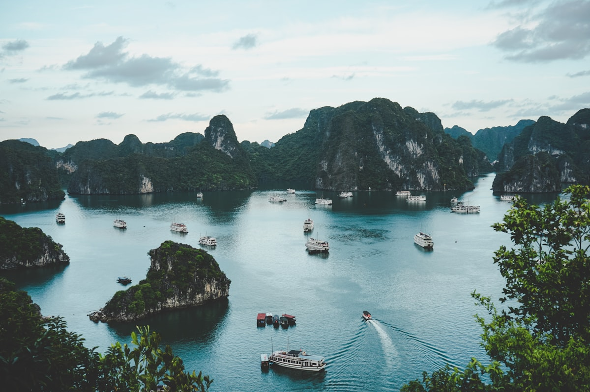

Las islas de karst de piedra caliza de la **Bahía de Ha Long** emergen de aguas verde jade en formas que parecen diseñadas más que formadas — pináculos, arcos, cuevas y torres que la leyenda local atribuye a un dragón que descendió del cielo para proteger a Vietnam de los invasores. Hay casi dos mil islas en la bahía, la mayoría deshabitadas, cubiertas de selva subtropical que llega casi hasta la línea de agua. Viajar a través de ellas en barco — que es la única forma real de hacerlo — crea una sensación sostenida de paso por un paisaje que la mente humana no está del todo equipada para procesar.

### Crucero por la Bahía

La Bahía de Ha Long se disfruta mejor en un **crucero de dos o tres noches a bordo de un junco tradicional**. Las opciones económicas viajan por las zonas más congestionadas del sur; los operadores premium navegan por la zona núcleo declarada Patrimonio de la UNESCO y el área más tranquila de la Isla de Cat Ba. El ritmo de vida a bordo — desayunos lentos en cubierta, kayak hacia el interior de sistemas de cuevas inundadas, nado desde el barco mientras el sol se pone detrás de la piedra caliza — es genuinamente una de las mejores formas de viajar en todo el Sudeste Asiático. La **Bahía de Lan Ha**, adyacente a Ha Long pero bajo la jurisdicción de la Isla de Cat Ba, recibe una fracción de visitantes con un paisaje casi idéntico.

### Cuevas, Kayaks y Pueblos Pesqueros

La **Hang Sung Sot (Cueva Sorprendente)** es la cueva más grande de la bahía y está a la altura de su nombre — cámaras de escala catedralicia iluminadas con luces de colores que son más dramáticas de lo que suenan. Mejor, porque más íntimo, es hacer kayak a través de un estrecho arco marino hacia una **laguna oculta**, rodeada por todos lados de piedra caliza vertical y silencio absoluto. Los **pueblos pesqueros flotantes** que todavía existen en la bahía — comunidades que viven todo el año en casas flotantes — están siendo lentamente trasladados a tierra, lo que hace que el puñado que quedan merezca la visita con un guía responsable mientras aún existen.

### Consejos y Trucos

- **La Calidad del Barco Varía Enormemente**: La diferencia entre un barco nocturno barato y un crucero de gama media es significativa en términos de seguridad, higiene y experiencia. Lee reseñas recientes con cuidado y elige un operador certificado por la Administración Nacional de Turismo de Vietnam.
- **Estacionalidad Climática**: La Bahía de Ha Long se visita mejor de octubre a abril. De mayo a septiembre hay riesgo de temporada de tifones y lluvias intensas. Los meses de invierno (diciembre a febrero) pueden ser fríos y brumosos — muchos encuentran que la niebla añade ambiente; otros la encuentran frustrante para la visibilidad.
- **La Conexión con Hanói**: La Bahía de Ha Long está a cuatro horas en autobús de Hanói, o en hidroavión para quienes tienen menos tiempo. La mayoría de operadores de cruceros incluyen el transporte en el precio del paquete. Se recomienda encarecidamente pasar al menos dos noches en Hanói antes o después.

### Puntos Destacados

- **Amanecer desde la Cubierta del Barco**: La luz de madrugada sobre las islas de piedra caliza, antes de que otros barcos se muevan, es la bahía en su momento más sereno y extraordinario.
- **Kayak hacia la Laguna de la Isla Ti Top**: La pequeña bahía cerrada en la Isla Ti Top, accesible solo en kayak a través de un arco bajo, ofrece un momento privado de aislamiento casi total.
- **Pesca de Calamares de Noche**: Muchos operadores de cruceros organizan pesca de calamares desde la popa después del anochecer. El plancton bioluminiscente en el agua perturbada alrededor de las luces es un espectáculo inesperado.
- **Ciudad de Cat Ba**: El principal asentamiento de la Isla de Cat Ba tiene un carácter genuino de pueblo pesquero vietnamita, con excelentes restaurantes de marisco y acceso a las rutas de senderismo del Parque Nacional de Cat Ba.

La Bahía de Ha Long solo pide que vayas lo suficientemente despacio para mirar. El paisaje se encarga del resto.

<small>_Foto de [Long Nguyễn](https://unsplash.com/photos/MKrqxmFlw4c) en Unsplash_</small>
