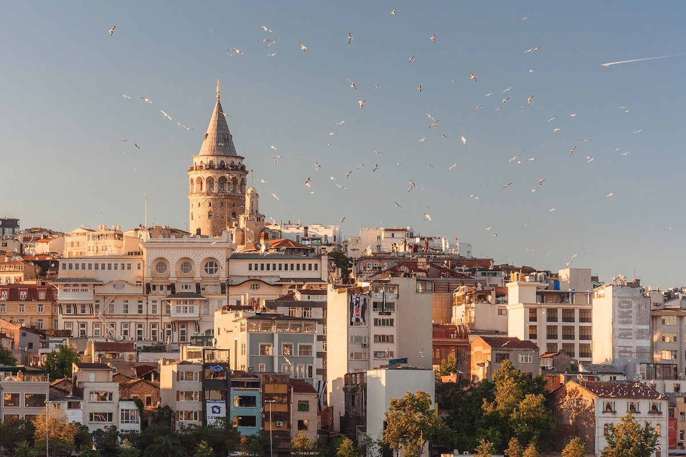

La llamada a la oración de la Mezquita Azul resuena sobre el Bósforo y se encuentra a sí misma regresando desde la orilla asiática. En Estambul, esto no es metáfora — la ciudad genuinamente atraviesa Europa y Asia, y el estrecho entre ellas ha sido el eje en torno al cual giraron los imperios durante tres milenios. La civilización bizantina, otomana y turca moderna han dejado cada una su huella en piedra, azulejo y cúpula sobre las mismas colinas, y el resultado es una ciudad de sobrecogedora densidad histórica que también consigue ser una de las más dinámicas y contemporáneas del mundo.

### Sultanahmet: La Península Histórica

El barrio de **Sultanahmet** concentra más historia por kilómetro cuadrado que casi cualquier otro lugar del mundo. La **Hagia Sophia** — originalmente catedral bizantina, convertida en mezquita en 1453, museo en el siglo XX y mezquita de nuevo en 2020 — es el pivote en torno al cual gira la historia de Estambul. Su cúpula central, flotando sobre un anillo de ventanas, crea un espacio interior que ha asombrado a los visitantes desde el año 537 d.C. Justo enfrente, la **Mezquita Azul** (Sultanahmet Camii) deslumbra con veinte mil azulejos de İznik pintados a mano en más de cincuenta tonos de azul. Entre ambas, el **Hipódromo** aún conserva los obeliscos y la columna que decoraban la pista de cuadrigas bizantina.

### El Bósforo y el Gran Bazar

El **Gran Bazar** — con más de 4.000 tiendas repartidas por 61 calles — es el mercado cubierto más antiguo y grande del mundo, y entrar en él hace entender inmediatamente por qué. El laberinto de oro, cuero, especias, cerámicas y alfombras es simultáneamente abrumador y magnífico. El regateo es esperado, la persistencia requerida. En contraste, el **Bazar de las Especias** en Eminönü es más pequeño y manejable, con sus puestos apilados de azafrán, albaricoques secos, delicias turcas y el lokum que impregna todo el mercado de su dulce perfume. El **crucero por el Bósforo** — reservable desde Eminönü por una fracción del precio de los barcos turísticos — viaja bajo tres grandes puentes entre dos continentes, pasando frente a palacios costeros otomanos y pueblos pesqueros que parecen inmutables desde hace un siglo.

### Consejos y Trucos

- **Etiqueta en las Mezquitas**: Todas las mezquitas requieren descalzarse y tener hombros y rodillas cubiertos. Las mujeres necesitan pañuelo en la cabeza. La mayoría de mezquitas los proporcionan en la entrada, pero llevar los propios es preferible. Las colas para entrar a la Hagia Sophia son severas — llega antes de las 8:30 o después de las 17:00.
- **Profundidad de Barrio**: Sultanahmet es el núcleo histórico, pero el carácter del Estambul moderno vive en **Beyoğlu**, al otro lado del Cuerno de Oro — la peatonal Avenida İstiklal, la Torre Gálata y las galerías y restaurantes de **Karaköy** son donde se concentra la creatividad contemporánea de Estambul.
- **La Cuestión del Té**: El té turco (çay) se sirve en pequeños vasos con forma de tulipa durante todo el día. Aceptar un vaso cuando se ofrece en una tienda no es una obligación de compra — es hospitalidad, y rechazarlo es levemente descortés.

### Puntos Destacados

- **Palacio de Topkapı**: El corazón administrativo y ceremonial del Imperio Otomano durante cuatro siglos — la sección del tesoro sola, con su trono de esmeralda y sus dagas enjoyadas, requiere dos horas.
- **Iglesia de Chora (Kariye Camii)**: Los mosaicos bizantinos más finos que existen — más íntimos que la Hagia Sophia y menos visitados.
- **Desayuno en Karaköy**: Un desayuno turco completo de quesos, aceitunas, miel, nata, huevos y simit es una de las mejores comidas matutinas del mundo. La cultura de café de Karaköy lo hace mejor.
- **Atardecer desde la Torre Gálata**: La vista de 360 grados sobre ambas orillas a la hora dorada es genuinamente uno de los grandes panoramas urbanos del mundo.

Estambul es la ciudad donde Oriente y Occidente no son opuestos sino ingredientes — mezclados durante tres mil años en algo completamente propio.

<small>_Foto de [Michael Parulava](https://unsplash.com/photos/lciwYx5XVOk) en Unsplash_</small>
