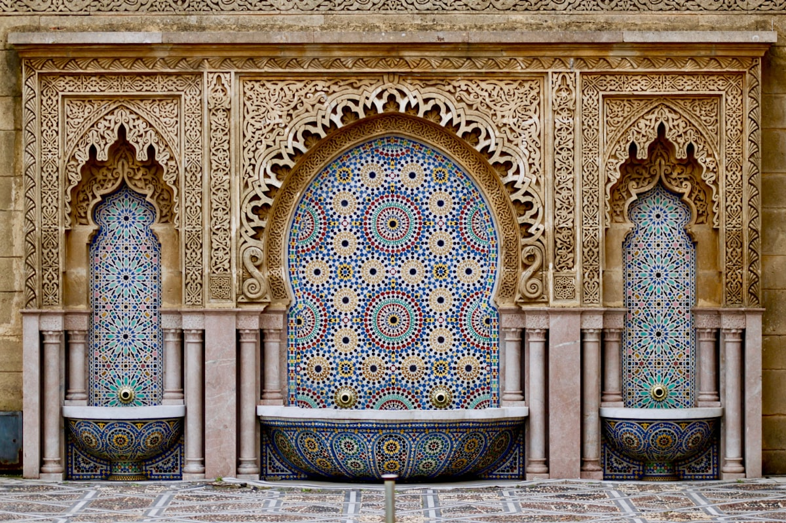

En el momento en que cruzas una de las antiguas puertas de las murallas color rojizo de la medina de Marrakech, el mundo moderno simplemente se evapora. Los callejones estrechos se tuercen en todas direcciones — un momento estás rodeada de pirámides de azafrán y rosas secas, al siguiente tropiezas con un patio escondido donde una fuente murmura bajo un dosel de cedro tallado. La medina fue construida para desorientar a los foráneos, y lo consigue de manera espectacular.

### Los Zocos y la Djemaa el-Fna

Los zocos están organizados aproximadamente por oficio — los zapateros agrupados cerca de las tenerías junto a Bab Debbagh, los faroles de latón colgados en el barrio de los artesanos del metal, montañas de alfombras tejidas en el distrito textil. Pero la lógica se disuelve rápidamente a medida que te adentras. El centro gravitacional de todo es la **Djemaa el-Fna**, una plaza reconocida por la UNESCO que se transforma a lo largo del día: vendedores de zumo y encantadores de serpientes por la tarde, y un vasto festín al aire libre de carnes asadas y cuentacuentos al caer la noche. La plaza se aprecia mejor desde la terraza de un café en su borde, con un té de menta en la mano.

### Riads y el Arte de Ir Despacio

Escondidos detrás de simples muros de cara a la calle, los **riads** — casas tradicionales con patio — son el gran secreto de Marrakech. Alojarse en uno cambia por completo el ritmo de la visita. Sales de un callejón caótico directamente a un mundo de naranjos, mosaicos de azulejos y quietud absoluta. El **Palacio de Bahía** ofrece una vislumbre de la grandiosidad de la tradición del riad a escala palacial: sala tras sala de azulejos zellij y techos pintados que a los artesanos marroquíes les llevó años completar.

### Consejos y Trucos

- **Guías y Navegación**: La medina requiere genuinamente un guía local durante el primer día o, al menos, mapas sin conexión descargados de antemano. Los "guías" bien intencionados que te abordan en la calle suelen actuar por comisión — una sonrisa firme y un paso decidido bastan en la mayoría de los casos.
- **Etiqueta del Regateo**: El regateo es habitual en los zocos pero tiene sus propias reglas no escritas. Empezar a un tercio del precio pedido y estar dispuesta a marcharte suele ser efectivo. Nunca hagas una oferta que no estés preparada a aceptar.
- **El Calor**: Entre mayo y septiembre, el calor de Marrakech es intenso. Lleva agua, viste lino suelto y planifica las visitas activas para primera hora de la mañana o última de la tarde.

### Puntos Destacados

- **Djemaa el-Fna de Noche**: Uno de los grandes espectáculos públicos del mundo — caótico, alegre y completamente inolvidable.
- **Tumbas Saadíes**: Un real panteón del siglo XVI descubierto solo en 1917 — la obra en yeso tallado es extraordinaria.
- **Maison de la Photographie**: Un extraordinario archivo de fotos históricas de Marruecos que reencuadra todo lo que ves fuera.
- **Café des Épices**: La mejor vista de terraza sobre el mercado de especias, con una cocina honesta a la altura.

Marrakech recompensa la paciencia y castiga las prisas. Suelta el mapa, sigue el olor del pan de un horno de leña y deja que la ciudad te encuentre.

<small>_Foto de [Jean Carlo Emer](https://unsplash.com/photos/UIwwV5GlyqY) en Unsplash_</small>
