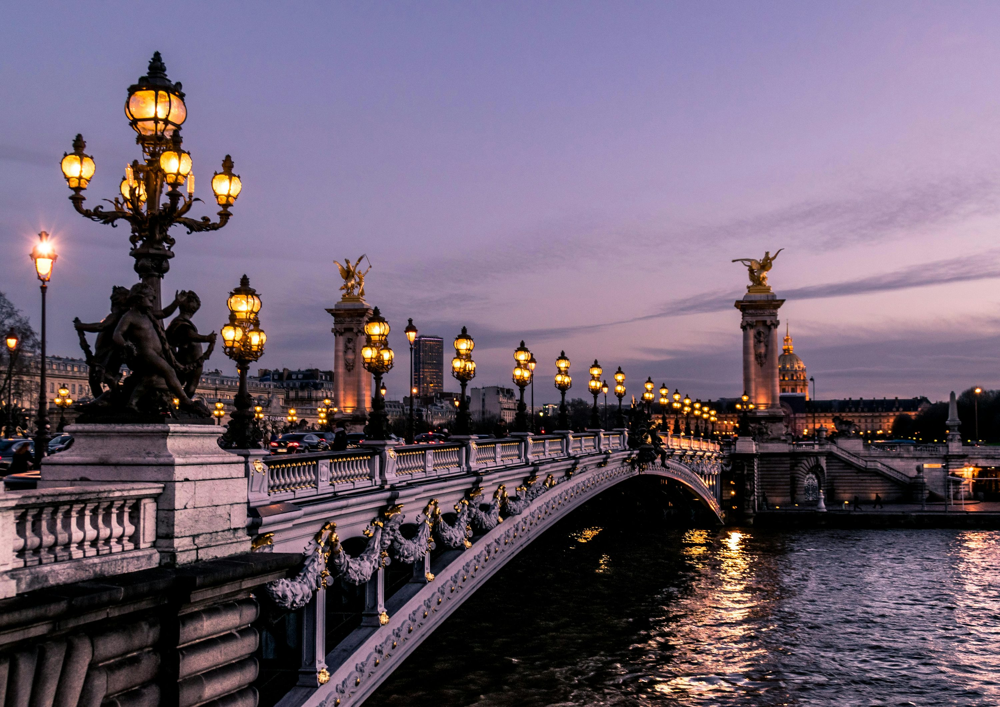

París de noche es una ciudad de luces y sombras, pero para mí, es una ciudad de fantasmas. Caminando por las calles estrechas y empedradas del Barrio Latino después de las 10 de la noche, casi puedes imaginar a los filósofos y revolucionarios del pasado debatiendo en los rincones de los cafés tenuemente iluminados.

### Serenata a Orillas del Sena
Nos saltamos los tours abarrotados durante el día y optamos por un **paseo de medianoche por el Sena**. Hay un silencio particular que cae sobre el río por la noche. Caminamos desde Pont Neuf pasando por la brillante fachada del **Louvre**, que parece más un joyero que un museo después del anochecer. Terminamos nuestra noche en **Montmartre**, viendo a los artistas locales todavía trabajando bajo las farolas en la Place du Tertre. La vista de la ciudad desde las escaleras del Sacré-Cœur a las 2 de la mañana es algo que nunca olvidaré.

### Comida Casera Callejera
Olvídate de las estrellas Michelin por un momento. Mi comida favorita en París fue un simple y humeante **crepe de Nutella y plátano** comprado en un carrito callejero cerca de Saint-Germain-des-Prés, comido mientras me apoyaba en una farola. Para una cena nocturna más sustanciosa, encontramos un bistró clásico que servía **Steak Frites** con una salsa de pimienta que era tan rica que se sentía como un abrazo en forma de comida.

### Consejos y Trucos
*   **La Trampa del Selfie**: Evita el Trocadéro al atardecer si odias las multitudes. Para una vista mejor (y más tranquila) de la Torre Eiffel, dirígete al Champ de Mars o busca un puente escondido como el Pont de Bir-Hakeim.
*   **Caminar es Obligatorio**: París se ve mejor a pie. Invierte en un par de zapatos para caminar elegantes pero resistentes. Tus tobillos te lo agradecerán.
*   **Seguridad Nocturna**: París es generalmente seguro, pero ten cuidado con los "vendedores de flores" y los "tejedores de pulseras" cerca de los principales monumentos; un "Non, merci" educado pero firme suele ser suficiente.

### Puntos Destacados
- **El Louvre de Noche**: Ver la Pirámide iluminada sin los 30.000 visitantes diarios.
- **Paseo por el Sena**: La mejor manera de ver los cimientos arquitectónicos de la ciudad.
- **Sacré-Cœur a las 2 AM**: La vista más tranquila y mágica de París.
- **El Crepe Perfecto**: Una alegría simple que define la experiencia parisina.

París de noche no es solo un lugar; es un estado de ánimo. Es una ciudad que te pide que vayas más despacio, mires hacia arriba y te permitas perderte un poco.

<small>*Foto de [Chris Karidis](https://unsplash.com/photos/nnzkZNYWHaU) en Unsplash*</small>
