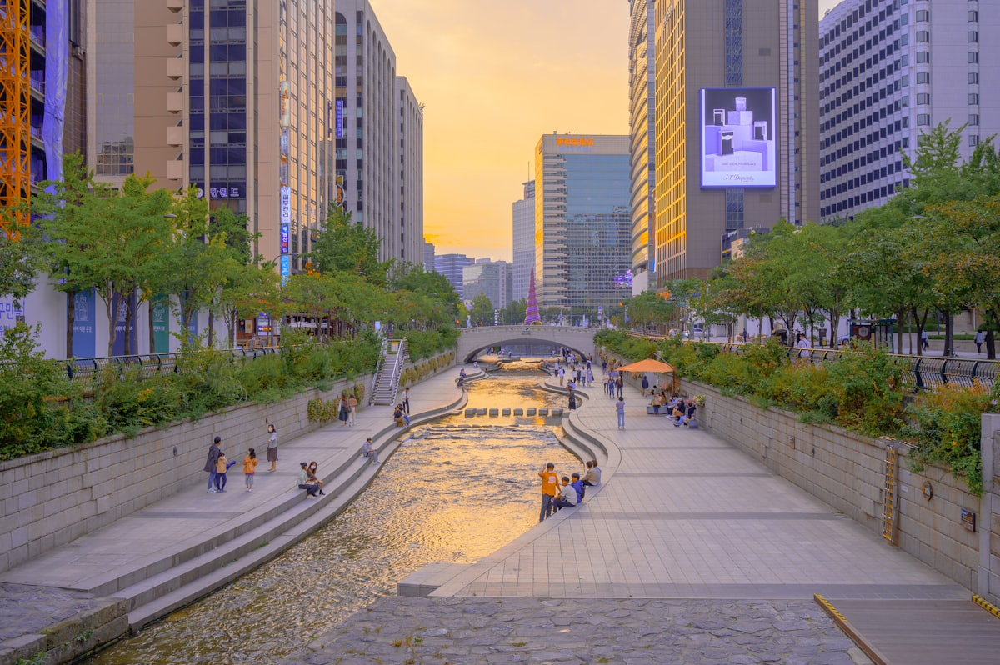

Seúl se mueve a una velocidad a la que otras ciudades aspiran. El sistema de transporte es impecable y frecuente, las tiendas de conveniencia abren toda la noche y son genuinamente convenientes, la cultura gastronómica es innovadora y profundamente tradicional simultáneamente, y la relación de la ciudad con su propio pasado — cinco palacios reales de la dinastía Joseon intactos dentro del área metropolitana — es una de las negociaciones urbanas más elegantes entre lo viejo y lo nuevo en cualquier lugar de Asia. Seúl es la ciudad que demuestra que no tienes que elegir entre herencia y ambición.

### El Palacio Gyeongbokgung y Bukchon

El **Palacio Gyeongbokgung** — el palacio real principal de la dinastía Joseon — fue construido por primera vez en 1395 y está rodeado por más de trescientos edificios tradicionales reconstruidos en un recinto que originalmente albergaba quinientos. La ceremonia del cambio de guardia en la puerta principal (a las 10:00 y 14:00 todos los días) se ejecuta con una precisión y un colorido que merecen atención. Inmediatamente al norte, el **Pueblo Hanok de Bukchon** es un barrio residencial de casas tradicionales coreanas (hanok) preservadas en una ladera entre los dos grandes palacios — callejones estrechos, aleros de madera, muros de piedra y las mejores cafeterías de la ciudad ocupando interiores de hanok reconvertidos.

### Hongdae y el Río Han

**Hongdae** — el barrio alrededor de la Universidad Hongik — es donde la cultura juvenil de Seúl corre en su forma más concentrada: locales de música indie, bailarines callejeros, diseñadores de moda independientes y puestos de street food abiertos hasta las 4 de la mañana. El contraste con el barrio del palacio a treinta minutos en metro es absoluto y es precisamente el punto sobre Seúl. El **Río Han** que biseca la ciudad es algo que la mayoría de visitantes infrautiliza — los parques fluviales (Yeouido, Banpo) se llenan de seulitas haciendo ciclismo, picnics y viendo la **Fuente Arcoíris del Puente Banpo** (la fuente de puente más larga del mundo) todas las noches. Unirse a ellos es una de las mejores formas de entender la ciudad.

### Consejos y Trucos

- **Tarjeta T-money**: La tarjeta de transporte que funciona en metro, autobús y taxis es una herramienta imprescindible en Seúl — disponible en cualquier tienda de conveniencia (GS25, CU, 7-Eleven) por un pequeño depósito, recargable en cualquier lugar, y que da tarifas ligeramente más baratas que pagar en efectivo.
- **La Experiencia del Jjimjilbang**: Un **jjimjilbang** (baño público coreano) es la experiencia esencial de Seúl que la mayoría de turistas se pierden. Pagas la entrada (alrededor de 10.000-15.000 won), te dan un uniforme y accedes a saunas a diferentes temperaturas, salas comunes y zonas para dormir. Muchos abren las 24 horas. Es extraordinario y totalmente accesible para no hablantes de coreano.
- **Protocolo de la Barbacoa Coreana**: En un restaurante de **samgyeopsal** (panceta de cerdo a la barbacoa), la parrilla está en tu mesa, los acompañamientos (banchan) son comunales y rellenables, y el soju o makgeolli es esencial. Pide los envoltorios de hoja de perilla y el doenjang jjigae junto a la carne.

### Puntos Destacados

- **Torre Namsan y la Muralla de la Ciudad de Seúl**: La caminata hasta la Torre N de Seúl a través del tramo restante de la muralla de la ciudad de 600 años es una experiencia meditativa en medio de una megalópolis.
- **Mercado Gwangjang**: El mercado más antiguo de Seúl, con seda cruda, tela vintage y un legendario patio de comidas donde los bindaetteok (tortitas de judía mungo) y el mayak kimbap (rollitos de arroz con sésamo) son los aperitivos definitorios.
- **Excursión de un Día a la DMZ**: La Zona Desmilitarizada en la frontera con Corea del Norte, alcanzable en una visita guiada desde Seúl en dos horas, es uno de los paisajes históricamente más cargados del mundo.
- **Insadong**: El barrio de las artes tradicionales, con galerías, casas de té y las mejores tiendas de artesanía tradicional de la ciudad — compra un producto de papel hanji, una taza de celadón o un tintero hecho a mano.

Seúl es una ciudad que sorprende en cada visita. Las capas no dejan de revelarse, y la profundidad sigue aumentando cuanto más tiempo le dedicas.

<small>_Foto de [Markus Winkler](https://unsplash.com/photos/YmawptEadgc) en Unsplash_</small>
