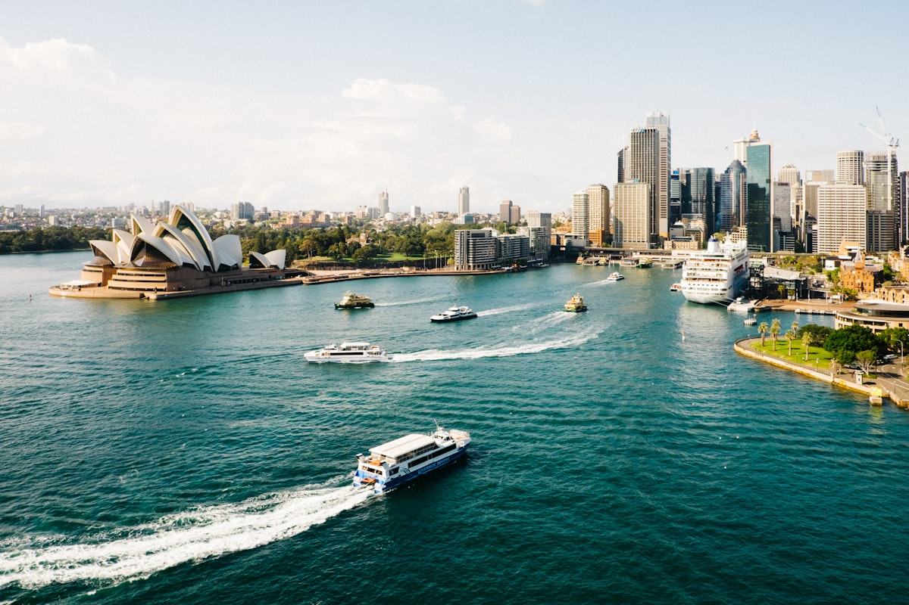

Pon una alarma de la que luego te alegrarás. El puerto de Sídney al amanecer pertenece a una categoría diferente de belleza — la que te deja en silencio. Los paneles de la Ópera atrapan la primera luz rosada mientras el Puente del Puerto se yergue como un arco de catedral oscura sobre el agua, y durante veinte minutos toda la escena resplandece con colores que parecen casi sintetizados. La ciudad alrededor aún duerme. El puerto es tuyo.

### El Puente y la Ópera

El **Puente del Puerto de Sídney** se entiende mejor desde abajo y desde arriba. Crúzalo gratis por el camino peatonal del lado este — la vista de la Ópera desde el punto medio del puente al amanecer es genuinamente uno de los mejores panoramas urbanos del mundo. Para la experiencia completa, el **BridgeClimb** te lleva al arco cumbre a 134 metros sobre el agua, aunque tiene un precio considerable. Al otro lado del agua, una visita guiada a la **Ópera de Sídney** revela la extraordinaria ingeniería acústica dentro de esas velas blancas — el edificio es mucho más complejo y hermoso por dentro de lo que sugiere la famosa fachada.

### Manly Beach y las Playas del Norte

El ferri de Circular Quay a **Manly Beach** es un trayecto de treinta minutos que funciona como uno de los mejores cruceros por el puerto del mundo — y cuesta solo el billete de ferri. La propia Manly combina una playa de surf clásica con un relajado pueblo costero que parece a años luz del centro de negocios. Si tienes más tiempo, las **Northern Beaches** se extienden hacia el norte durante treinta kilómetros de costa de surf cada vez más salvaje, culminando en **Palm Beach**, escenario del rodaje de Home and Away y todavía impresionantemente bella en la vida real.

### Consejos y Trucos

- **Bondi hasta Coogee**: Evita la aglomeración turística en Bondi sola y camina el **Bondi to Coogee Coastal Walk** — seis kilómetros de sendero en los acantilados con extraordinarias vistas al mar y varias playas perfectas para nadar en el camino.
- **Conciencia Solar**: El índice UV de Sídney alcanza niveles extremos incluso en días nublados. Un protector solar respetuoso con los arrecifes FPS 50+ es imprescindible, reaplicado cada hora.
- **La Cuestión de las Ostras**: Las Sydney Rock Oysters del **Sydney Fish Market** son extraordinarias — más pequeñas e intensamente sabrosas que las ostras del Pacífico, y mejor comidas de pie en el muelle con una copa de vino blanco frío del Valle Hunter.

### Puntos Destacados

- **Amanecer en la Silla de la Señora Macquarie**: El promontorio con la mejor vista simultánea del Puente y la Ópera de toda la ciudad.
- **Taronga Zoo**: Las vistas al puerto desde la sección superior del zoo pueden ser mejores que cualquier cosa en la propia ciudad.
- **Newtown**: El barrio creativo y lleno de cafeterías de Sídney, donde se concentran las mejores librerías independientes y locales de música en vivo.
- **Barangaroo**: El nuevo paseo marítimo que combina arquitectura ambiciosa con un paisaje cultural aborigen revivido.

Sídney es el tipo de ciudad que te entrega belleza sin pedirte mucho a cambio. Solo requiere que llegues lo suficientemente temprano para verla.

<small>_Foto de [Benjamin Sow](https://unsplash.com/photos/ZsH1wHv2iTU) en Unsplash_</small>
