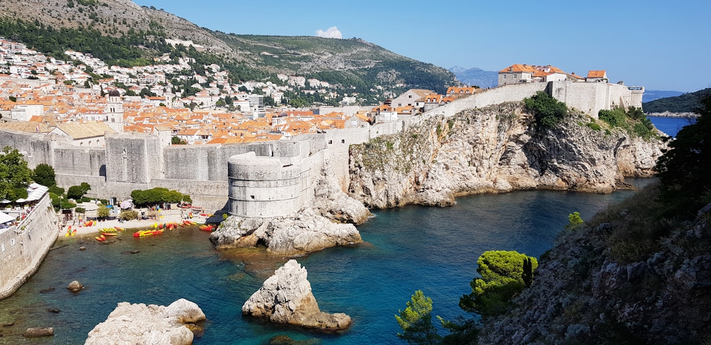

海から見ると、ドゥブロヴニクは完璧な地中海の構図を作りたかった誰かがそこに置いたように見える。石灰岩の城壁は午後の光を浴びてアンバー色に輝き、テラコッタ色の屋根が水へと流れ落ち、アドリア海は名付けられることを拒む青さだ。その城壁の内側、旧市街は1990年代の砲撃を受けた後、見事に修復された——その回復力が街を歩くことを単なる観光以上のものにしている。

### 城壁

**城壁**の周遊路は海、屋根、そして外港の上に延びる2キロメートルの切れ目なき城塁の遊歩道で——世界最高の散策路のひとつだ。城壁は平均4メートルの厚さがあり、場所によっては25メートルの高さに達する。海側にはアドリア海が水平線まで広がる。内陸側には旧市街全体が地図のように眼下に広がる。入場券は早めに購入しよう——城壁は午前半ばには混雑し始め、間違った方向（時計回りが良い）に進むと人の流れに逆らうことになる。最高地点にある**ミンチェタ要塞**からの眺めは格別だ。

### ストラドゥンと隠れた路地

石灰岩の広い遊歩道**ストラドゥン**はドゥブロヴニクの背骨だ——幾世紀もの足音で磨かれ、写真を撮るのが申し訳ないほど絵になる。しかし旧市街の本当の個性は、その両側に急勾配で登る路地に宿っている。地元の家族が今も洗濯物を干しながら暮らしている場所だ。**ブザ・バー**——城壁の穴を通り抜けることでのみたどり着ける、崖に直接刻み込まれたバー——は、ヨーロッパで最もドラマチックな立地の飲み場かもしれない。下の岩場で泳ぎ、登り返して冷たいクロアチアのビールを飲もう。

### ヒントとアドバイス

- **オーバーツーリズムは現実**: 7月と8月はドゥブロヴニクの旧市街が人の塊と化す。普通に近い体験をしたければ5月、6月初旬か10月に訪れること。それでも城壁には午前8時に到着しよう。
- **ケーブルカーという選択肢**: 旧市街の上の**スルジ山**へのケーブルカーは4分足らずで頂上に着き、すべてを文脈の中で捉えられる眺めを提供する——旧市街、島々、本土の山々。頂上のナポレオン時代の古い砦には、1991〜92年の包囲戦に関する優れた博物館がある。
- **島への逃避**: **ロクルム島**へのフェリーは12分。島は森に覆われ、孔雀が歩き回り、水泳用の塩水湖がある——賑わうストラドゥンの完全なる解毒剤だ。

### ハイライト

- **日の出の城壁**: それがあなただけのものになる唯一の時間。
- **ロヴリイェナツ要塞**: 城壁の外に立つ独立した要塞は、港を見渡す眺めで「ゲーム・オブ・スローンズ」にも登場した——歴史のために訪れ、夏のシェイクスピア公演のために留まろう。
- **ペリェシャツ半島の牡蠣**: 北への道はクロアチア最高のワイン産地と牡蠣養殖の村を通る——丸一日の価値ある日帰りトリップだ。
- **スタリ・グラード（フヴァル島）**: 近くのフヴァル島は90分のフェリーで行け、まったく異なる、より都会的なアドリア海体験を提供する。

ドゥブロヴニクは混雑の中でも、その評判に十分以上に応える。すべての写真に本当に応える場所のひとつだ。

<small>_Photo by [Cat Bassano](https://unsplash.com/photos/C2-XJaEpeKY) on Unsplash_</small>
