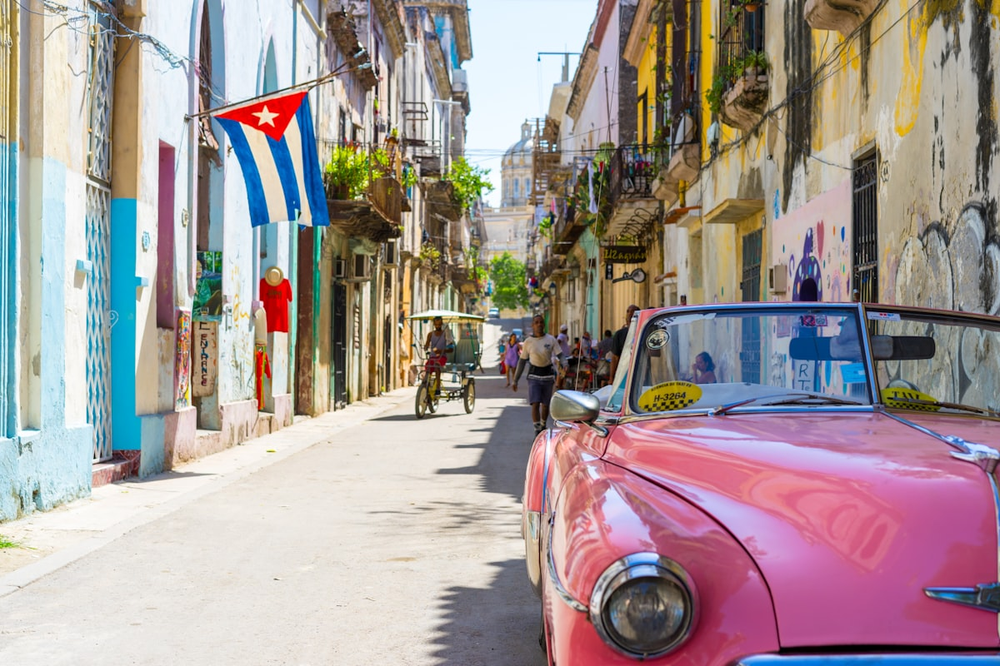

ハバナは文の途中で凍りついた街だ。1950年代のアメリカ車——キャンディカラーのビュイックやシボレー、エンジンをロシア製ディーゼルに換装して——がアイゼンハワー大統領の時代から何も変わっていないかのようにマレコン（海沿いの遊歩道）を流す。ハバナ旧市街の植民地時代の外観は、崩れゆきながらも壮大だ。そのすべてを通じて、ハバナの人々は温かさと音楽と創意工夫をもって動いており、それはどこにも再現不可能な何かだ。

### ハバナ・ビエハ——旧市街

**ハバナ・ビエハ**はUNESCO世界遺産に認定された植民地時代の旧市街で、ゆっくりではあるが確実に修復が進んでいる。4つの主要広場——**プラサ・デ・アルマス**、プラサ・ビエハ、プラサ・デ・サン・フランシスコ、プラサ・デ・ラ・カテドラル——はそれぞれ独自の個性と歴史を持っている。サン・クリストバル大聖堂は完成まで約一世紀を要したバロック様式の傑作だ。夕方になると、ソンやボレロを演奏するミュージシャンたちが通りに溢れる——厳密に観光客向けでもなく、しかし彼らに無関心でもない。ラムは優れていて、驚くほど安価だ。

### マレコンとベダード

**マレコン**はハバナの広大な屋外の居間だ——6キロメートルの海沿いの散歩道に、漁師、恋人たち、チェスの愛好家、哲学者が共存する。時間帯を変えて両方向を歩こう。マレコンの先の**ベダード**地区には別のハバナがある——並木道、中世紀のホテル、そして歴史ある上流階級のための壮麗な大理石の霊廟が立ち並ぶ**コロン墓地**——アメリカ大陸で最も優れた墓地のひとつだ。

### ヒントとアドバイス

- **通貨の現実**: キューバの通貨状況は実際に複雑だ。必要以上の現金を持参しよう——米国の銀行発行のクレジットカードは使えず、ATMの信頼性も不安定だ。ユーロかカナダドルが最も両替しやすい。
- **インターネットアクセス**: キューバのWiFiは、スクラッチカードで購入できる指定ホットスポットに限定されている。その接続の断絶を楽しもう——ハバナは完全な注意を払うことを要求し、それを報いてくれる。
- **カサ・パルティクラルとホテル**: 民営の**カサ・パルティクラル**（民宿）に泊まることで、ハバナの日常生活と直接触れることができ、国営ホテルよりも大抵は良くて安い。

### ハイライト

- **国立美術館**: ラテンアメリカ最高クラスの美術館のひとつで、キューバ内外のコレクションに分かれている——キューバの近代・現代美術は特に卓越している。
- **エル・フロリディタ**: ヘミングウェイのダイキリバーは今やバーというより記念碑になっているが、ダイキリはまだ本当に美味しい。
- **ファブリカ・デ・アルテ・クバーノ**: ハバナのクリエイティブセンター——かつての食用油工場がギャラリー、パフォーマンススペース、バーへと転換。木〜日曜日開館で、ハバナの若いクリエイティブクラスで賑わう。
- **マレコンの夜明け**: 街が目覚める前、漁師たちが遊歩道に並び、光は他のどの時間帯とも全く違う。

ハバナはあなたのために何かになろうとしない。ただそれ自体であるだけ——それが十分以上であることがわかる。

<small>_Photo by [Meg von Haartman](https://unsplash.com/photos/rSqq_JQOU4k) on Unsplash_</small>
