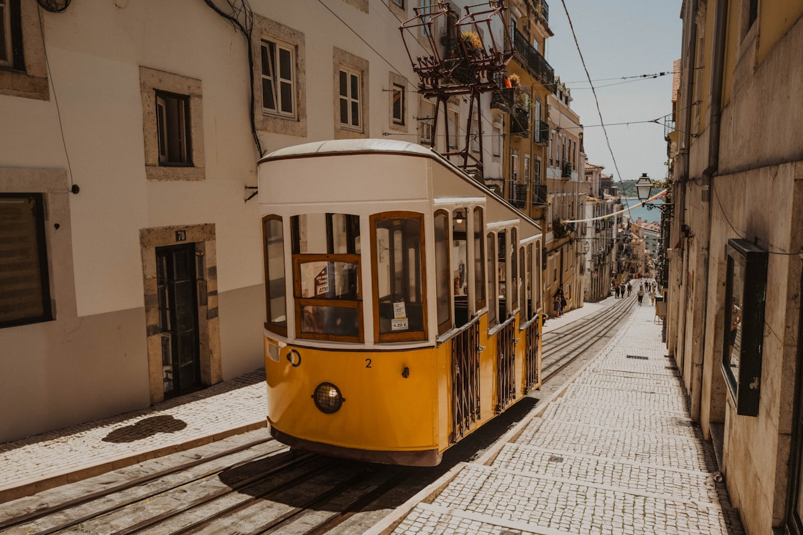

リスボンはゆっくりと体に入ってくる街だ。ここの光には独特の質感があり——正午でも温かく水平で、建物ファサードの古いタイルをアンバーとブルーのモザイクに変える。黄色いトラムが登れないと思えるほど急な坂を軋みながら登る。旧市街の各地に散らばる丘の上の展望台「ミラドウロ」から、街はテージョ川の広い河口へと流れ落ち、その先には大西洋が広がる。リスボンはヨーロッパの端にあり、同時に世界の中心にあるような感覚をもたらす。

### アルファマとファドの魂

**アルファマ**はリスボン最古の地区で、1755年の大地震が他の多くを破壊した際にも生き残った細い路地の迷路だ。その路地は焼き鰯と洗濯物と古い石の香りがする。ここが**ファド**——ポルトガルの哀愁のある音楽の伝統——が最もオーセンティックに息づいている場所だ。アルファマの小さなファドハウスで夜を過ごし、ファディスタがギターの伴奏とともに郷愁と運命の歌（サウダーデ）を歌うのを聴く体験は、ヨーロッパのどこでも得られる最も感情的に力強い音楽体験のひとつだ。**サン・ジョルジェ城**は地区を戴冠し、川と眼下の街の最高の眺めを提供する。

### ベレンと大航海時代

西へ路面電車で行くと到着する**ベレン**地区は、ポルトガルの大航海時代の出発と帰着の地だ。**ジェロニモス修道院**はマヌエル様式ゴシックの最高峰——あらゆる表面に黄金の石灰岩で航海のシンボル、天球儀、縄の彫刻が施されている。近くの**発見のモニュメント**は、エンリケ航海王子が探検家たちの行列を率いて西の海へと向かう姿を示す。そして1837年から続く**パステイス・デ・ベレン**の菓子屋は、オリジナルレシピのパステル・デ・ナタ（卵のタルト）を提供しており、どこでもコピーされ、どこでも超えられていない。

### ヒントとアドバイス

- **トラム28番**: リスボンの有名なトラム28番は最も急峻な地区を通る本格的な歴史的路面電車体験だが、観光客のスリの標的にもなりやすい。バッグは前に持ち、スマートフォンはポケットに、観光スポットの停留所では特に警戒しよう。
- **エレベーター文化**: リスボンには複数の歴史的なケーブルカー（エレベーダール）と有名な**サンタ・ジュスタのエレベーター**がある——どれも genuine な郷愁と素晴らしい眺めをもたらすが、相当な行列もある。地元の人の多くはただ階段を歩く。
- **ワインの地理**: リスボンは3つの優れたワイン産地の交差点に位置する。北からの爽やかな**ヴィーニョ・ヴェルデ**、複雑な**ドウロ**の赤ワイン、そして**セトゥーバル半島**の非凡な酒精強化ワインがすべて手の届く距離にある。

### ハイライト

- **グラサの展望台（ミラドウロ・ダ・グラサ）**: 観光客より地元の人に使われる市内最高の展望台で、バーとアルファマの屋根越しの最高の夕日の眺め。
- **LXファクトリー**: アルカンタラに建つ旧工業施設が、市内最高の日曜市場とギャラリー、レストラン、リスボン最高の書店を抱えるスペースに転換されている。
- **シントラ**: ロッシオ駅から電車で40分のUNESCO登録の丘の街は、おとぎ話の宮殿が点在し、一日かける価値が十分にある日帰り旅行だ。
- **タイム・アウト・マーケット**: カイス・ド・ソドレーの屋根付き食品マーケットが、街中から最高の名店を一つの雰囲気ある屋根の下に集めている。

リスボンはあなたを急かさない。明るく、辛抱強く、あなたが自分のペースを見つけるのを待っている。

<small>_Photo by [Sarah Markstaller](https://unsplash.com/photos/tHD_jRV_0l4) on Unsplash_</small>
