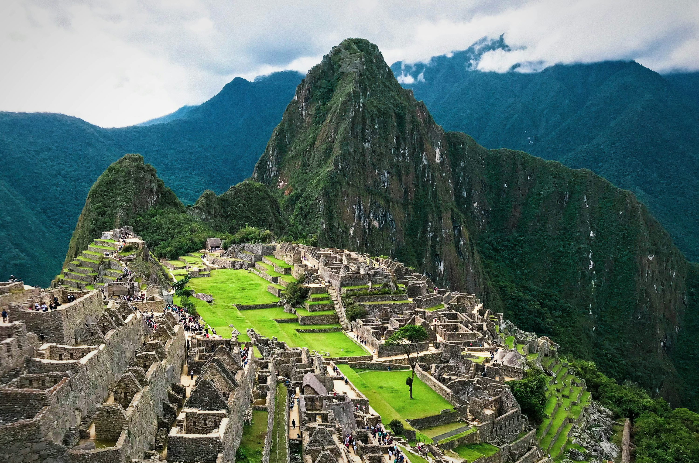

マチュピチュは雲の上の都市。人間が山々と調和して働いたときに何を達成できるかを示す証です。歴史オタクの私は、インカ帝国に関する本を何十冊も読んできましたが、霧が晴れてあの象徴的な「ポストカード」のような景色が現れたとき、古代の石の上に立って思わず涙がこぼれました。

### 聖なる上昇

私たちは最初の光が城塞に届くちょうどその時、**太陽の門（インティプンク、Inti Punku）**に到着しました。棚田を覆っていた影が引いていく様子は、数世紀の眠りから都市が目覚めるのを見守っているようでした。午前中は主な遺跡を探索しました。特に太陽の神殿は、精密な石造り技術の傑作です。

高いところが平気なら、**ワイナピチュ（Huayna Picchu）への登山**は欠かせません。「死の階段」とも呼ばれるほど急で狭い道ですが、そこから見下ろすマチュピチュ全景と遠くを流れるウルバンバ川の眺めは比類なきものです。肉体的な挑戦を経て、爽快感と風景との深いつながりを感じることができます。

### 高地の味

ペルー料理は世界最高峰。高地でもその質は変わりません。下山後、私たちは大皿の**ロモ・サルタード（Lomo Saltado）**をシェアしました。ペルー固有の食材と東アジアの影響（醤油、生姜、そしてカリカリのフライドポテト！）が見事に融合した炒め物です。飲み物は、インカ帝国以前からアンデス地方で親しまれてきた紫トウモロコシの飲み物、**チチャ・モラーダ（Chicha Morada）**で喉を潤しました。

### ヒントとアドバイス

- **順応するか、苦しむか**: 直接マチュピチュへ向かってはいけません。まずはクスコ（標高3,400m）で少なくとも2〜3日過ごしましょう。肺が感謝することでしょう。
- **かなり早めに予約**: ワイナピチュのチケットは4〜6ヶ月前に売り切れることもあります。直前まで放置しないでください！
- **日差しが強烈**: この高度では、曇っていても数分で日焼けします。高数値のSPF日焼け止めを使用してください。

### ハイライト

- **太陽の門**: 遺跡への最も象徴的な入り口。
- **インティワタナ**: 「太陽を繋ぎ止める石」と呼ばれ、天文学の驚異。
- **ワイナピチュ**: 心臓が高鳴る登山と、世界クラスのご褒美。
- **ロモ・サルタード**: 文化と味覚の素晴らしい結婚。

マチュピチュは単なる遺跡ではありません。エネルギーです。静寂に耳を傾け、過去の残響を想像させる場所なのです。

<small>_Photo by [Willian Justen de Vasconcellos](https://unsplash.com/photos/8_S_b_x_J_I) on Unsplash_</small>
