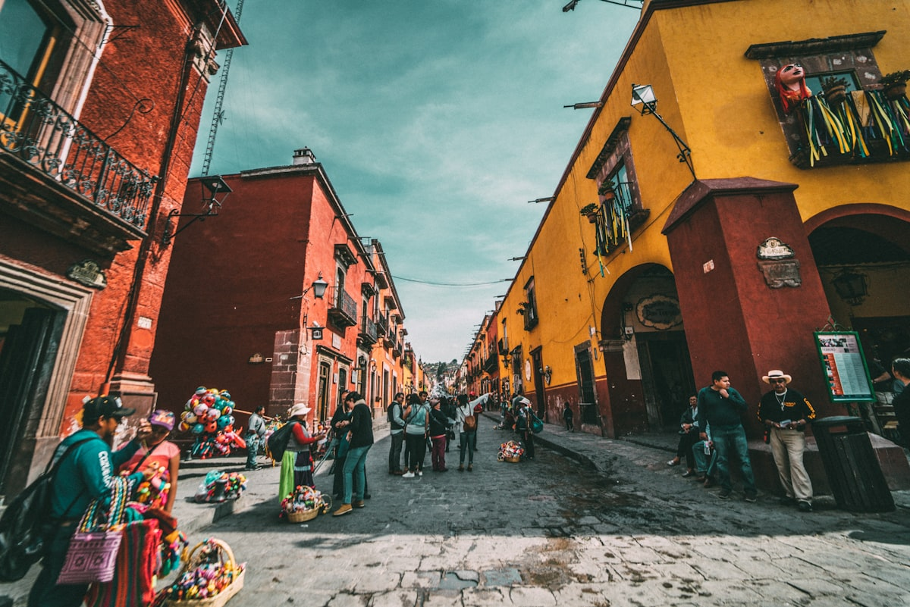

メキシコシティは湖の上に建てられた。アステカの首都テノチティトランは、堤道で結ばれた人工島としてテスココ湖の水面から立ち上がり、スペイン人が1521年に征服した後、その上に直接植民地の首都を建設した。それ以来、街は湖底の基礎に沈み続けている——植民地時代の建物が他の場所では建設業者を警戒させるような角度で傾いている——しかしその通りの下に圧縮された文明の層こそが、メキシコシティをアメリカ大陸で最も歴史的に密度が高く、文化的に卓越した都市のひとつにしている。

### ソカロと古代のメキシコ

**ソカロ**——正式名称は憲法広場——は世界最高の公共広場のひとつだ。大都市大聖堂（部分的にアステカの神殿の石で建てられた）、国立宮殿（ディエゴ・リベラの壁画に覆われている）、そして**テンプロ・マヨール**の遺跡が隣接する広大な平坦な空間。テンプロ・マヨールはテノチティトランの儀式の中枢で、1978年に工事作業員が偶然ピッケルでそれに当たるまで現代の通りの下に埋もれていた。隣接する**テンプロ・マヨール博物館**は非凡な発見物を展示し、アステカの宇宙論を明瞭さと深さをもって説明している——これほどのことを達成する博物館は稀だ。

### ローマとコンデサ——現代の街

**ローマ**と**コンデサ**地区はメキシコシティの現代的な創造的生活を体現している——アール・ヌーヴォーとアール・デコの建物が並ぶ並木道が、優れたレストラン、カフェ、書店、ギャラリーへと転換されている。**メルカド・メデジン**の朝の市場は地区の料理人たちが買い物をする場所で——新鮮な農産物、チーズ、花のスタンドは圧巻だ。**チャプルテペク国立人類学博物館**はおそらく世界最高の人類学博物館だ——アステカの太陽の石だけで訪問を正当化するが、メキシコのすべての先コロンブス期文化にまたがるコレクションはその範囲と質において圧倒される。

### ヒントとアドバイス

- **標高の現実**: メキシコシティは標高2,240メートル——一部の訪問者に高山病を引き起こすほど高い。水を大量に飲み、初日はアルコールを避け、最初の24時間は体調に関わらずゆっくりと過ごそう。
- **タコスの地理**: メキシコシティのタコス文化は圧倒的でかつ壮大だ。回転する串から切る**アル・パストール**（コンデサエリアが最高）と日曜の朝に伝統市場で食べる**バルバコアのコンソメ**が二つの必須体験だ。観光向けのタコスチェーンは避けること。
- **交通とトランスポート**: メキシコシティの地下鉄はラテンアメリカで二番目に大きく、驚くほど安く、通常は街を横断する最速の方法だ。地上の交通は実際に困難だ。Metro アプリをダウンロードしてナビゲートしよう。

### ハイライト

- **フリーダ・カーロ博物館（ラ・カサ・アスル）**: コヨアカンにあるカーロの家は世界最高の芸術的巡礼地のひとつ——鮮やかで、親密で、真に感動的だ。入場券は数週間前に予約すること。
- **ソチミルコのトラヒネラス**: 街の南の古代運河ネットワークで、色鮮やかな平底ボートが毎週末チナンパ（浮き農園）を通じて家族やミュージシャンを運ぶ。
- **ルチャ・リブレ**: **アレナ・メキシコ**での金曜夜の試合——マスク、アクロバティクス、演劇的な悪役——は偉大なメキシカン文化の光景のひとつだ。
- **ベジャス・アルテス宮殿**: アール・ヌーヴォー/アール・デコのオペラハウスと文化センターには、驚くべき質のリベラ、シケイロス、オロスコの壁画が収蔵されている。

メキシコシティは見下ろすことをしない。すべてを——歴史、食べ物、芸術、混沌、美——提供し、それを通り抜けて自分の道を見つけることを信頼している。

<small>_Photo by [Dennis Schrader](https://unsplash.com/photos/sH85-pkNmoA) on Unsplash_</small>
