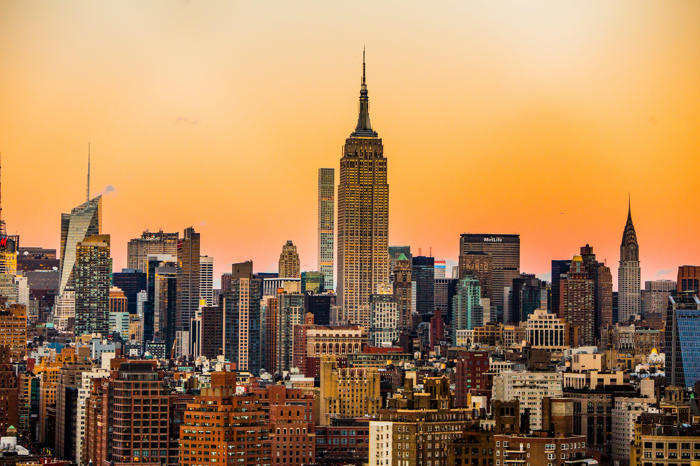

ニューヨークは単に眠らない街ではありません。常に振動しています。都市のエネルギーを糧にする写真家にとって、NYCは究極の遊び場です。あらゆる角がフレームであり、地下鉄のあらゆる移動が物語。この「コンクリートジャングル」には、私が訪れたどの森にも負けない美しさがあります。

### 街路の頭上で

ある朝、歴史的な貨物鉄道の跡地に作られた空中庭園、**ハイライン（The High Line）**を散策しました。超高層ビルの間を縫うように走るこの場所は、都市再開発の手本のような場所で、街の建築を覗き見るようなユニークな視点を与えてくれます。昼食には食料を買い込み、セントラルパークのシープ・メドウ（Sheep Meadow）で**ピクニック**をしました。周囲の「ビリオネアズ・ロウ（億万長者通り）」のスカイラインを背景にした緑の芝生のコントラストは、まさにニューヨークならではの光景です。

一日の締めくくりには、エンパイア・ステート・ビルディングは避け（混雑しすぎているため！）、ロックフェラー・センターの**トップ・オブ・ザ・ロック（Top of the Rock）**へ向かいました。プロのアドバイス：こここそが、夕暮れ時に明かりが灯るエンパイア・ステート・ビルディングを最も美しく眺められる場所です。

### 天国の一切れ（とベーグル）

ニューヨークに来て、5つの区をまたいで食べ歩かないわけにはいきません。一日の始まりは、地元のデリで買ったクラシックな**エブリシング・ベーグル（スモークサーモンとクリームチーズたっぷり）**から。ここではこれが唯一の正しい朝食です。夕食には、カーマイン通りの「ジョーズ・ピザ（Joe's Pizza）」で、歩道に立って4ドルの**ペパロニピザのスライス**を頬張るという「ニューヨーク流」を楽しみました。薄くて、折りたたんで食べる。これこそが完璧な味です。

### ヒントとアドバイス

- **メトロカードは万能**: マンハッタンでUberを使う必要はありません。地下鉄の方が速くて安いです。スマートフォンの非接触決済「OMNY」を使えば、券売機の列に並ぶ必要もありません。
- **ファッションより快適さ**: 気づかないうちに一日に15キロ以上歩くことになります。「おしゃれな」靴ではなく、最高のスニーカーを履いてください。
- **上を見る**: ニューヨークの人々はうつむいたり、前だけを見て歩くことで有名です。でも、ふと上を見上げれば、世界で最も美しいアールデコの装飾を目にすることができるでしょう。

### ハイライト

- **ハイライン**: グレーの都市の中を走る穏やかな緑のリボン。
- **トップ・オブ・ザ・ロック**: 街を360度見渡す最高の展望台。
- **ジョーズ・ピザ**: 評判に違わぬ、料理のランドマーク。
- **セントラルパーク**: 「都市の肺」であり、人間観察に最高の場所。

ニューヨークは、常に全力投球を求めてくる街です。騒々しく、速く、そして最高に刺激的です。

<small>_Photo by [Luca Bravo](https://unsplash.com/photos/O_f6M_J_v_I) on Unsplash_</small>
