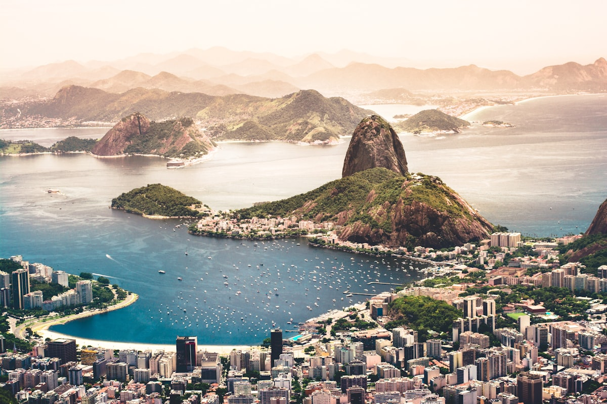

**コルコバードの丘**の頂上から、コルコバードのキリスト像は両腕を広げ、幾何学的に不可能とも思える街を見下ろしている——鬱蒼とした山と息をのむ大西洋の海岸線の間に押し込まれた高密度な都市の広がり。グアナバラ湾が北に輝き、イパネマとコパカバーナが南に延び、ファベーラが丘の斜面をテラコッタ色の段々で登っていく。リオは段階を踏んで迎えてくれない。すべてが一度に押し寄せてくる。

### コパカバーナとイパネマ

リオのビーチはそれ自体がひとつの文明だ。**コパカバーナ**と**イパネマ**はインフォーマルな区画に分かれていて、それぞれのエリアに常連と、ゲームと、サウンドトラックがある。早朝は、ランナーやバレーボールの選手、そしてモザイクタイルのプロムナードを歩く年配のカップルたちのものだ。正午になると、すべての屋台と波がこちらの注意を引こうとする。イパネマ東端の**アルポアドールの岩場**はリオの非公認の夕日観覧スタンドで——太陽が沈む瞬間、地元の人々が拍手を送る。気がつくとあなたも一緒に拍手している。

### コルコバードとティジュカの森

**ティジュカの森**——世界最大の都市内熱帯雨林——を抜けて**コルコバードの丘**へ向かう電車は、スロートラベルの偉大な体験のひとつだ。森が窓に押し寄せ、湿度高く、鳥のさえずりに満ちている。頂上では、**コルコバードのキリスト像**が360度のパノラマを支配しており、その広大さに方向感覚を取り戻すまで数分かかる。最悪の混雑を避けるには夜明けか夕方に訪れ、晴れた日にはペトロポリスの向こうの山脈まで見渡せる。

### ヒントとアドバイス

- **ゾナ・スルとゾナ・ノルテ**: 観光客はゾナ・スルのビーチに集中する。より本物のリオを体感するには**ゾナ・ノルテ**へ——巨大な北東文化市場「フェイラ・デ・サン・クリストバン」を訪れるか、木曜の夜にラパのサンバのリハーサルに参加しよう。
- **安全への意識**: リオには実際のセキュリティ上の課題がある。ビーチではスマートフォンをポケットに、地図アプリを使い、夜間の避けるべきルートについての地元のアドバイスに従おう。常識があれば対処できる街だ。
- **アサイーのルール**: バナナとグラノーラがのったアサイーの冷凍ボウルをビーチのキオスクで食べることは、絶対に外せないリオの朝食だ。それ以外は本来の意味を失っている。

### ハイライト

- **ポン・ジ・アスーカル（シュガーローフ山）**: 日没のグアナバラ湾を見渡すロープウェイの眺めは世界クラスだ。
- **夜のラパのアーチ**: 19世紀の水道橋が毎週末のアウトドアサンバダンスの最高の舞台となる。
- **サンタ・テレサ**: 歴史的なトラムで辿り着くアーティストの丘のボヘミアン地区、ブーゲンビリア、そして素晴らしいバーが並ぶ。
- **マラカナン・スタジアム**: 試合がなくても、サッカーの神話の中での位置づけだけで訪れる価値がある伝説のスタジアム。

リオはあなたが準備できているかどうか問わない。準備できていると仮定しているし、大抵それは正しい。

<small>_Photo by [Eelco Böhtlingk](https://unsplash.com/photos/dveIRGNIC1M) on Unsplash_</small>
