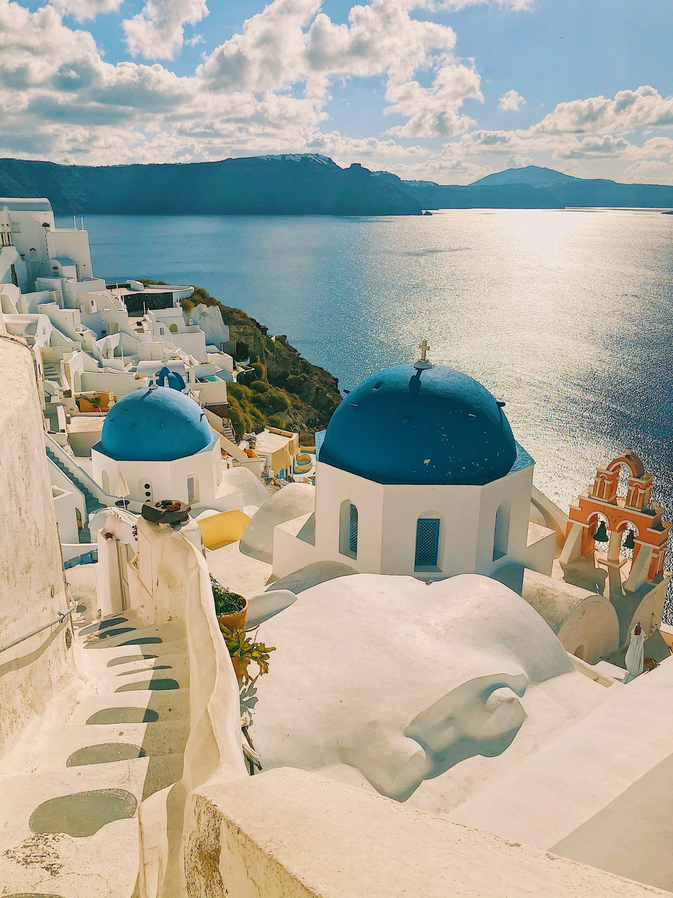

写真家にとって、サントリーニ島は最高の夢であると同時に、最も困難な挑戦でもあります。あの信じられないほど青いドーム屋根と、さらに青く見える海とのコントラストをどうやって切り取ればいいのでしょうか。ここは、光があまりにも鮮明で、手を伸ばせばその破片を掴み取れるのではないかと感じさせる場所です。

### カルデラ・ハイキング
私たちは観光用のロバは利用せず、**フィラからイアまでの伝説的な10kmのハイキング**に挑戦しました。荒々しく砂埃の舞う道ですが、島で最も息をのむようなカルデラの景色を楽しむことができます。ゴールデンアワーが始まるちょうどその時にイアへ到着するように時間を合わせました。メインストリートは非常に混雑していましたが、私たちは**ビザンチン城跡**の近くに静かな場所を見つけ、エーゲ海に太陽が沈むのを眺めました。有名なのには理由があります。空は、私が存在すら知らなかったような色に染まりました。

また、**ネア・カメニ火山へのボートツアー**にも参加しました。黒い溶岩の上を歩き、その後、オレンジ色に染まったパレア・カメニの温かい温泉で泳ぐ体験は、山の上に広がる真っ白な村々とは対照的で素晴らしいものでした。

### 火山性土壌の味
サントリーニ島の火山性土壌は、私がこれまでに食べた中で最も味わい深い野菜を育みます。ピルゴスの地元のタベルナで午後を過ごした際、**ファバ（Fava）**という料理に夢中になりました。クリーミーなイエロースプリットピーのピューレに、ケッパーと赤玉ねぎがのっています。しかし、真の主役は**トマケフテデス（Tomatokeftedes、トマトのフリッター）**でした。外はカリッと、中は太陽をたっぷり浴びて熟したミニトマトの果汁が溢れ出します。

### ヒントとアドバイス
*   **大型客船の波**: 島に滞在しているなら、大型客船がいつ入港するかを調べておきましょう。その時間帯は、フィラやイアではなく、エンポリオやピルゴスといった内陸の村を探索するのが賢明です。
*   **強烈な太陽**: フィラからイアへのハイキングコースには日陰がほとんどありません。帽子をかぶり、午前8時前には出発するようにしましょう。
*   **アクロティリは必見**: 表面的な美しさだけに目を向けないでください。先史時代のアクロティリ遺跡（「ギリシャのポンペイ」）は、驚くほど詳細に保存されており、圧倒されます。

### ハイライト
- **フィラからイアへのハイキング**: 10kmにわたる、海岸線の劇的なロケーション。
- **ビザンチン城跡の夕日**: 世界で最も有名な夕日の一つ。
- **アクロティリ**: 青銅器時代の都市を垣間見ることができる魅力的な場所。
- **トマトのフリッター**: キクラデス諸島で見つけられる最高のスナック。

サントリーニ島は火と光の場所です。しばらくの間、携帯電話を置いて、ただ水平線を眺めることを求めてくる島なのです。

<small>*Photo by [Heidi Kaden](https://unsplash.com/photos/1pS6mK3n7oU) on Unsplash*</small>
