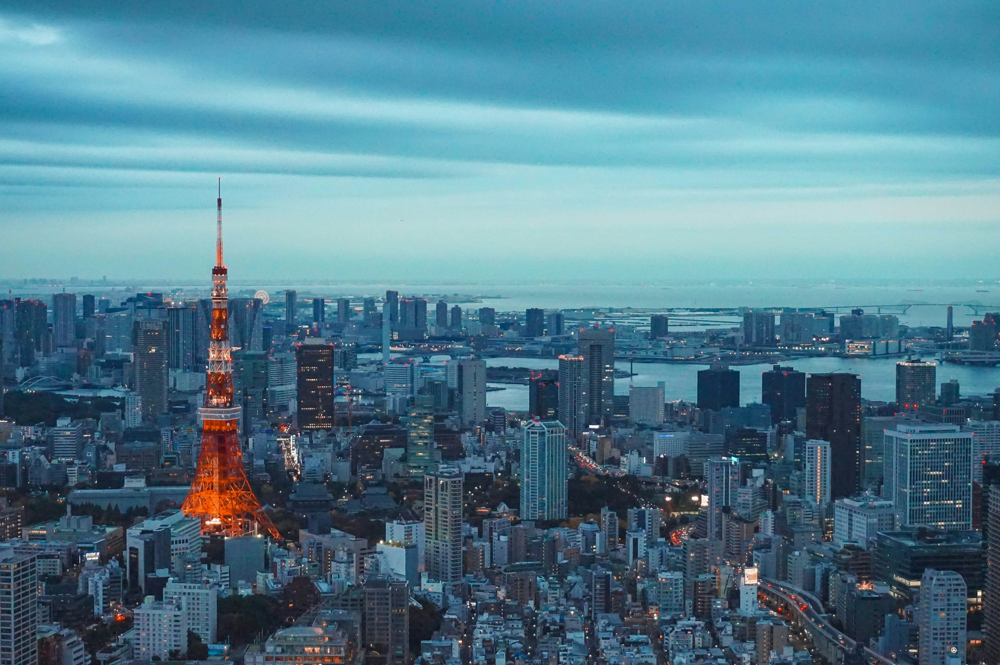

東京は層が重なり合ったような街。2050年に建てられたかのような超高層ビルの影に、400年の歴史を持つ神社が静かに佇んでいます。写真家として私が大好きなのは、新宿のネオン煌めく混沌から、瞬きする間に寺院の庭の深く苔むした静寂へと街が切り替わる様子です。

### 混沌と静寂

私たちの一日は**渋谷のスクランブル交差点**から始まりました。千人もの人々が異なる方向へ動き出し、誰にもぶつからずに通り過ぎていく様子には、不思議と瞑想的な雰囲気すら漂います。そこから**秋葉原**へ「テック・ハント」に向かいました。ガジェットやアニメ文化の圧倒的なスケールは、最高の意味で刺激的です。

夕方には、**築地場外市場**を散策しました。卸売市場は移転しましたが、場外市場は今なお、これまでに見たことがないほど新鮮なシーフードを売る小さな店々が迷路のように並んでいます。夜の締めくくりは、新宿の**ゴールデン街**。わずか数名しか座れないような極小のバーが200軒以上も集まるエリアです。地元の客とお酒を酌み交わし、物語を共有するには最高の場所です。

### 一杯の芸術

東京は間違いなく世界の食の都です。私たちは**一蘭**でラーメンを食べるために45分間並びましたが、それは一秒たりとも無駄ではありませんでした。濃厚な豚骨スープ、完璧な歯ごたえの麺、そしてすべてをまとめ上げる秘伝の赤いタレ。また、上野では手軽に**回転寿司**を楽しみました。職人たちの仕事の速さと精密さは、それ自体が一つのパフォーマンスのようです。

### ヒントとアドバイス

- **Suicaは生活必需品**: SuicaやPasmoカードを入手しましょう（Apple PayやGoogle Payに追加するのが便利です）。地下鉄、バスだけでなく、自動販売機やコンビニでも使えます。
- **現金も大切**: カードが使える場所も増えていますが、小さなバーや伝統的なラーメン店では今でも現金のみの店が多いです。常にいくらかの日本円を持ち歩きましょう。
- **ゴミ箱の謎**: 東京には公共のゴミ箱がほとんどありません。小さな袋を持ち歩き、ゴミはホテルまで持ち帰る準備をしておきましょう。

### ハイライト

- **渋谷スクランブル交差点**: 世界で最も有名な交差点。
- **ゴールデン街のバー**: 新宿の小さく親密な魂を垣間見ることができます。
- **一蘭のラーメン**: ラーメンのゴールドスタンダードとされる理由がわかります。
- **明治神宮**: 都会の真ん中に広がる、穏やかな森。

東京は、曲がり角ごとに驚きを与えてくれる街です。好奇心を持ち、礼儀正しく、そして空腹でいることを求めてくる、そんな場所です。

<small>_Photo by [Jezael Melgoza](https://unsplash.com/photos/0_S_b_x_J_I) on Unsplash_</small>
